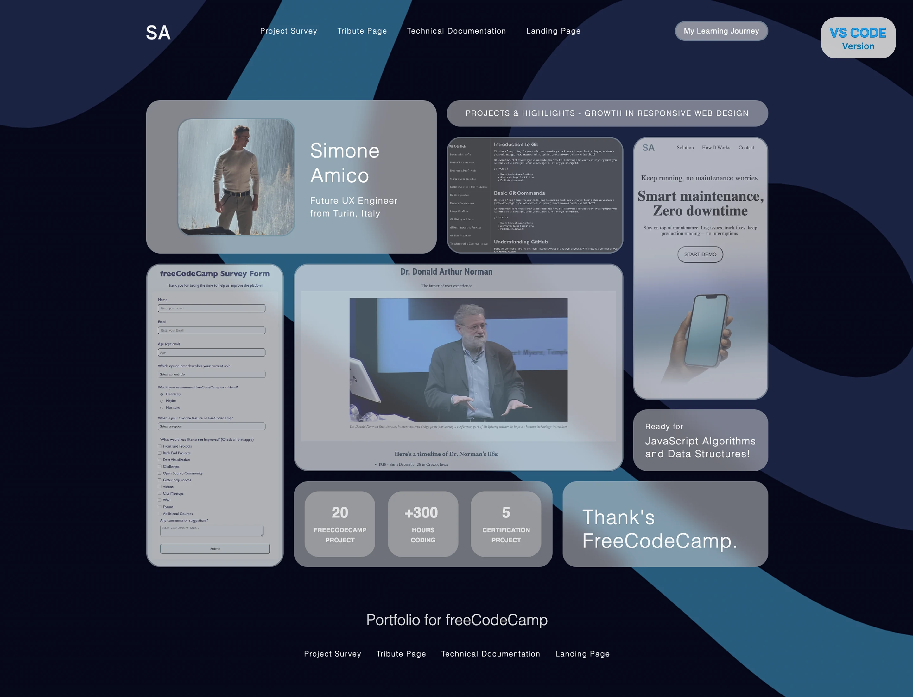
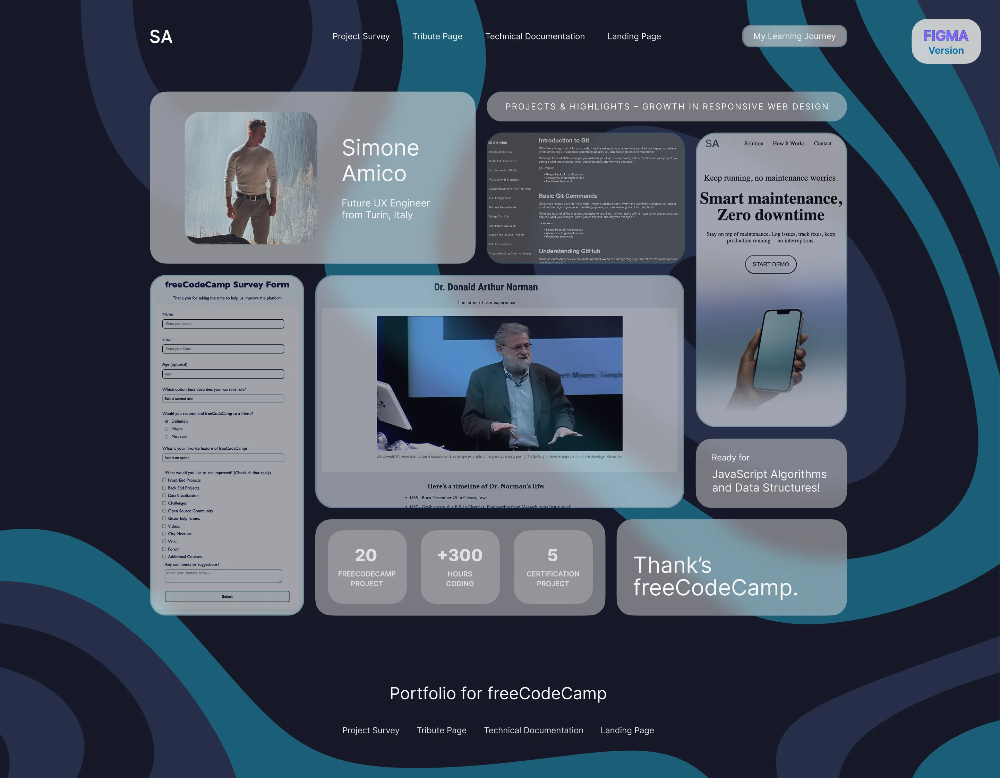
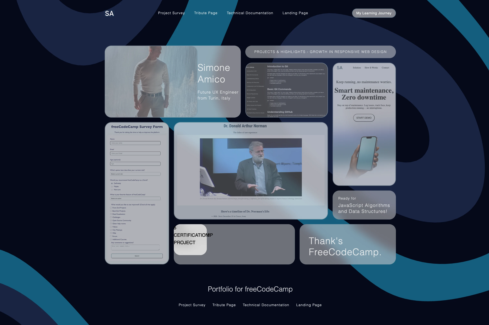

import Tabs from '@theme/Tabs';
import TabItem from '@theme/TabItem';

# Personal Portfolio




### The Project
Professional personal portfolio with glassmorphism design and bento grid layout, developed as freeCodeCamp's final certification project. A turning point that marked the completion of the first major chapter of my development journey.

### Source Code

<Tabs>
<TabItem value="html" label="index.html" default>

```html
<!DOCTYPE html>
<html lang="en">
<head>
    <meta charset="UTF-8">
    <meta name="viewport" content="width=device-width, initial-scale=1.0">
    <title>Simone Amico - freeCodeCamp Portfolio</title>
    <link rel="stylesheet" href="styles.css">
</head>
<body>
    <div class="page-container">
        <header>
            <div class="navbar-container">

                <div class="navbar-logo">
                    <a href="/">
                        
                    </a>
                </div>

                <nav class="navbar-navigation-link top-navbar-navigation-link" aria-label="Main Navigation">
                    <ul class="ul-list">
                        <li><a href="https://github.com/simoneamico-ux-dev/my-learning-journey/blob/main/05-survey-form/survey-form.html" class="nav-link" target="_blank" rel="noopener noreferrer">Project Survey</a></li>
                        <li><a href="https://github.com/simoneamico-ux-dev/my-learning-journey/tree/main/10-tribute-page" class="nav-link" target="_blank" rel="noopener noreferrer">Tribute Page</a></li>
                        <li><a href="https://github.com/simoneamico-ux-dev/my-learning-journey/tree/main/14-technical-documentation-page" class="nav-link" target="_blank" rel="noopener noreferrer">Technical Documentation</a></li>
                        <li><a href="https://github.com/simoneamico-ux-dev/my-learning-journey/tree/main/17-landing-page" class="nav-link" target="_blank" rel="noopener noreferrer">Landing Page</a></li>
                    </ul>
                </nav>

                <form action="https://github.com/simoneamico-ux-dev/my-learning-journey" method="get" target="_blank">
                    <button type="submit" class="navbar-button">My Learning Journey</button>
                </form>

            </div>
        </header>

        <main>
            <div class="bento-container">

                <div class="card hero-intro">
                    <div class="text-container">
                        <h1 class="hero-intro-first-text">Simone Amico</h1>
                        <h2 class="hero-intro-second-text">Future UX Engineer<br>from Turin, Italy</h2>
                    </div>
                </div>

                <a href="https://github.com/simoneamico-ux-dev" target="_blank" rel="noopener noreferrer">
                    
                </a>

                    <div class="card banner-highlights">
                        <p>PROJECTS & HIGHLIGHTS - GROWTH IN RESPONSIVE WEB DESIGN</p>
                    </div>

                <a href="https://github.com/simoneamico-ux-dev/my-learning-journey/blob/main/05-survey-form/survey-form.html" target="_blank" rel="noopener noreferrer">
                    <div class="card project-1">
                        
                    </div>
                </a>

                <a href="https://github.com/simoneamico-ux-dev/my-learning-journey/tree/main/10-tribute-page" target="_blank" rel="noopener noreferrer">
                    <div class="card project-2">
                        
                    </div>
                </a>

                <a href="https://github.com/simoneamico-ux-dev/my-learning-journey/tree/main/14-technical-documentation-page" target="_blank" rel="noopener noreferrer">
                    <div class="card project-3">
                        
                    </div>
                </a>

                <a href="https://github.com/simoneamico-ux-dev/my-learning-journey/tree/main/17-landing-page" target="_blank" rel="noopener noreferrer">
                    <div class="card project-4">
                        
                    </div>
                </a>

                <div class="card status-learning">
                    <div class="text-container">
                        <p class="status-learning-first-text">Ready for</p>
                        <p class="status-learning-second-text">JavaScript Algorithms<br>and Data Structures!</p>
                    </div>
                </div>

                <div class="card stats-dashboard">

                    <div class="card stats-item stats-item-1">
                        <p class="stats-item-text stats-item-text-top stats-item-1-text-1">20</p>
                        <p class="stats-item-text stats-item-text-bottom stats-item-1-text-2">FREECODECAMP<br>PROJECT</p>
                    </div>

                    <div class="card stats-item stats-item-2">
                        <p class="stats-item-text stats-item-text-top stats-item-2-text-1">+300</p>
                        <p class="stats-item-text stats-item-text-bottom stats-item-2-text-2">HOURS<br>CODING</p>
                    </div>

                    <div class="card stats-item stats-item-3">
                        <p class="stats-item-text stats-item-text-top stats-item-3-text-1">5</p>
                        <p class="stats-item-text stats-item-text-bottom stats-item-3-text-2">CERTIFICATION<br>PROJECT</p>
                    </div>
                </div>

                <div class="card credits-thanks">
                    <p>Thank's<br>FreeCodeCamp.</p>
                </div>

            </div>
        </main>

        <footer>
            <p class="footer-phrase"><a href="https://www.freecodecamp.org/">Portfolio for freeCodeCamp</a></p>

            <nav class="navbar-navigation-link bottom-navbar-navigation-link" aria-label="Main Navigation">
                <ul class="ul-list-2">
                    <li><a href="https://github.com/simoneamico-ux-dev/my-learning-journey/blob/main/05-survey-form/survey-form.html" class="nav-link" target="_blank" rel="noopener noreferrer">Project Survey</a></li>
                    <li><a href="https://github.com/simoneamico-ux-dev/my-learning-journey/tree/main/10-tribute-page" class="nav-link" target="_blank" rel="noopener noreferrer">Tribute Page</a></li>
                    <li><a href="https://github.com/simoneamico-ux-dev/my-learning-journey/tree/main/14-technical-documentation-page" class="nav-link" target="_blank" rel="noopener noreferrer">Technical Documentation</a></li>
                    <li><a href="https://github.com/simoneamico-ux-dev/my-learning-journey/tree/main/17-landing-page" class="nav-link" target="_blank" rel="noopener noreferrer">Landing Page</a></li>
                </ul>
            </nav>
        </footer>
    </div>

    <div class="rotate-message">
    <div class="rotate-card">
        <div class="emoji">🔄️</div>
        <p>Rotate for mobile preview</p>
        <p>or watch it come alive on desktop</p>
    </div>
    </div>
</div>

</div>

</div>

</body>
</html>
```
</TabItem>

<TabItem value="css" label="styles.css">

```css
:root {

/* SIZE*/
--width-container-grid: 1007px;
--height-container-grid: 757px;


/* COLOR */
--background-important-card: rgba(217, 217, 217, 0.6);
--background-medium-card: rgba(217, 217, 217, 0.5);

--blur-card: blur(13px);


/* BORDER */
--border-radius: 23px;

--border-card-clickable: 2px solid rgba(28, 93, 120, 0.30);


/* MARGIN */
--margin-between-linknavbar: 32px;
--margin-between-bottom-linknavbar: 24px;

--margin-top-frame-navbar: 36px;
--margin-bottom-navbar-grid: 64px;

--margin-between-card: 16px;

--margin-bottom-grid-footertitle: 96px;
--margin-bottom-footertitle-link: 32px;
--margin-bottom-link-endframe: 64px;

}

/* TOTAL RESET */

*, *::before, *::after {
    box-sizing: border-box;
    margin: 0;
    padding: 0;
}

html, body {
    height: 100%;
    font-family: 'Inter', sans-serif;
    background-image: 
        linear-gradient(rgba(0, 0, 0, 0.5), rgba(0, 0, 0, 0.5)),
        url("https://github.com/user-attachments/assets/52383e7b-cd63-4058-9464-bbc15e27508b");
    background-repeat: no-repeat;
    background-position: center;
    background-size: cover;
    background-attachment: fixed;
}

html {
    scroll-behavior: smooth;
}

body {
    line-height: 1.6;
    overflow-x: hidden;
}

button {
    font-family: inherit;
    font-size: inherit;
    font-weight: inherit;
    color: inherit;
    border: none;
    background: none;
    cursor: pointer;
}

a {
    text-decoration: none;
}

.logo {
    border: none;
}


/* TOTAL CONTAINER */
.page-container {
    width: 1004px;
    height: 1121px;
    margin: 0 auto;
    position: relative;
}


/* HEADER */
.navbar-container {
    width: 100%;
    z-index: 999;
    display: flex;
    align-items: center;
    justify-content: space-between;
    position: relative;
    top: var(--margin-top-frame-navbar);
    font-size: 12px;
}

.navbar-container .ul-list {
    margin: 0;
}

.navbar-logo {
    width: 33px;
    height: 20.31px;
}

.ul-list {
    display: flex;
    list-style: none;
    gap: var(--margin-between-linknavbar);
    margin: 0;
    padding: 0;
}

.ul-list a {
    color: #F6F6F6;
    font-weight: 200;
    letter-spacing: 1.1px;
}

.navbar-button {
    width: 151px;
    height: 32px;
    background: var(--background-important-card);
    border: var(--border-card-clickable);
    backdrop-filter: blur(13px);
    border-radius: var(--border-radius);
    color: #F6F6F6;
    letter-spacing: 0.5px;
}

/* BENTO GRIDS */

.bento-container {
    width: 1004px;
    height: 755px;
    position: relative;
}

.card {
    border-radius: var(--border-radius);
    background: var(--background-medium-card);
    z-index: 999;
    backdrop-filter: var(--blur-card);
    position: absolute;
}

.card img {
    width: 100%;
    height: 100%;
    object-fit: cover;
    border-radius: var(--border-radius);
    opacity: 0.45;
}

img {
    border: var(--border-card-clickable);
}

.hero-intro {
    width: 469px;
    height: 248px;
    top: 132px;
    left: 0;
    background: var(--background-important-card);
    font-weight: 300;
    color: #fff;
    letter-spacing: 1.1px;
    position: relative;
}

h1 {
    font-weight: 300;
}

h2 {
    font-weight: 300;
}

.hero-intro-first-text {
    top: 62px;
    left: 265px;
    font-size: 32px;
    margin-bottom: 14px;
    line-height: 2.5rem;
    position: absolute;
}

.hero-intro-second-text {
    top: 152px;
    left: 265px;
    font-size: 14px;
    line-height: 1.3rem;
    position: absolute;
}

.img-hero {
    width: 191px;
    height: 191px;
    top: 161.25px;
    left: 50px;
    z-index: 1000;
    object-fit: cover;
    position: absolute;
    border-radius: 23px;
    opacity: 0.85;
}

.banner-highlights {
    width: 519px;
    height: 43px;
    top: 132px;
    left: 485px;
    font-size: 12px;
    font-weight: 300;
    color: #fffffff5;
    display: flex;
    text-align: center;
    justify-content: center;
    align-items: center;
    letter-spacing: 1.4px;
}

.project-1 {
    width: 222px;
    height: 491px;
    top: 396px;
    left: 0;
    cursor: pointer;
}

.project-2 {
    width: 532px;
    height: 336px;
    top: 396px;
    left: 238px;
    cursor: pointer;
}

.project-3 {
    width: 285px;
    height: 189px;
    top: 191px;
    left: 485px;
    cursor: pointer;
}

.project-4 {
    width: 218px;
    height: 425px;
    top: 191px;
    left: 786px;
    cursor: pointer;
}

.status-learning {
    width: 218px;
    height: 100px;
    top: 632px;
    left: 786px;
    font-weight: 300;
    color: #fffffff5;
    letter-spacing: 1.1px;
    display: flex;
    justify-content: center;
    align-items: center;
}

.status-learning-first-text {
    font-size: 12px;
    margin-bottom: 4px;
}

.status-learning-second-text {
    font-size: 16px;
    line-height: 1.3rem;
}


.stats-dashboard {
    width: 418px;
    height: 139px;
    top: 748px;
    left: 238px;
}

.stats-item {
    width: 114px;
    height: 106.43px;
    top: 16px;
    opacity: 0.85;
    object-fit: cover;
    position: absolute;
    display: flex;
    justify-content: center;
    align-items: center;
    text-align: center;
    background: rgba(105, 105, 105, 0.1);
    backdrop-filter: var(--blur-card);
}

.stats-item-1 {
    left: 18px;
    right: 286px;
}

.stats-item-2 {
    left: 152px;
    right: 152px;
}

.stats-item-3 {
    left: 286px;
    right: 18px;
}

.stats-item-text {
    position: absolute;
    color: #F6F6F6;
}

.stats-item-text-top {
    top: 15px;
    font-size: 24px;
    font-weight: 800;;
}

.stats-item-text-bottom {
    top: 56px;
    font-size: 10px;
    font-weight: 600;
}

.stats-item-2-text-1 {
    padding-right: 6px;
}


.credits-thanks {
    width: 332px;
    height: 139px;
    top: 748px;
    left: 672px;
    font-weight: 300;
    font-size: 32px;
    color: #ffffffea;
    letter-spacing: 1.1px;
    display: flex;
    justify-content: center;
    align-items: center;
    line-height: 1.2;
    padding-top: 16px;
    padding-right: 16px;
}


/* FOOTER */

.footer-phrase {
    position: absolute;
    top: 985px;
    left: 0;
    right: 0;
    font-weight: 300;
    font-size: 24px;
    color: #f6f6f6db;
    display: flex;
    justify-content: center;
    align-items: center; 
}

.footer-phrase a {
    color: inherit;
    cursor: pointer;
}

.bottom-navbar-navigation-link {
    position: absolute;
    top: 1045px;
    left: 0;
    right: 0;
    display: flex;
    justify-content: center;
    align-items: center;
}

.ul-list-2 {
    display: flex;
    list-style: none;
    gap: var(--margin-between-bottom-linknavbar);
    margin: 0;
    padding: 0;
}

.ul-list-2 a {
    color: #F6F6F6;
    font-weight: 200;
    letter-spacing: 1.1px;
    font-size: 12px;
}


/* ANIMATION */

.project-1, .project-2, .project-3, .project-4, .img-hero, .navbar-button {
    transition: all 0.3s ease;
}

.project-1 img, .project-2 img, .project-3 img, .project-4 img {
    transition: all 0.3s ease;
}

@media (hover: hover) and (pointer: fine) {
    .img-hero:hover {
        transform: scale(1.05);
        z-index: 1001;
        box-shadow: 0 15px 30px rgba(0, 0, 0, 0.15);
        filter: brightness(1.2) contrast(1.1) saturate(1.3);
        opacity: 1;
    }

    .project-1:hover, .project-2:hover, .project-3:hover, .project-4:hover , .navbar-button:hover {
        transform: scale(1.05);
        z-index: 1001;
        box-shadow: 0 15px 30px rgba(0, 0, 0, 0.5);
    }

    .project-1:hover img, .project-2:hover img, .project-3:hover img, .project-4:hover img, .navbar-button:hover{
        filter: brightness(1.2) contrast(1.1) saturate(1.3);
        opacity: 1;
    }
}

.project-1:active, .project-2:active, .project-3:active, .project-4:active , .img-hero:active, .navbar-button:active {
    transform: scale(0.95);
    box-shadow: 0 5px 10px rgba(0, 0, 0, 0.3);
    transition: all 0.3s ease;
}

.rotate-message {
  display: none;
}

@media (hover: none) and (pointer: coarse) {
    .card img {
    opacity: 0.6;
    }
}


@media (max-width: 600px) {
  .rotate-message {
    position: fixed !important;
    inset: 0;
    display: flex !important;
    justify-content: center;
    align-items: center;
    z-index: 99999;
    background: 
    linear-gradient(rgba(0, 0, 0, 0.4), rgba(0, 0, 0, 0.4)), 
    url("https://github.com/user-attachments/assets/52383e7b-cd63-4058-9464-bbc15e27508b");
    background-size: cover;
    background-position: center;
    background-attachment: fixed;
  }
  
  .rotate-card {
    min-width: (380px, 95vw);
    max-height: 300px;
    background: var(--background-important-card);
    backdrop-filter: var(--blur-card);
    border-radius: var(--border-radius);
    border: var(--border-card-clickable);
    padding: 2rem;
    display: flex;
    flex-direction: column;
    justify-content: center;
    align-items: center;
    text-align: center;
    color: #F6F6F6;
    font-weight: 400;
    letter-spacing: 1.1px;
    line-height: 1.4;
    font-size: 32px;
  }
  .emoji {
    font-size: 64px;
  }
}


/* Galaxy S21... */
@media (orientation: landscape) and (min-height: 320px) and (max-height: 390px) and (min-width: 780px) and (max-width: 849px)  {
  .page-container {
    zoom: 0.7;
  }
}

/* Smartphone foldable */
@media (orientation: landscape) and (min-height: 320px) and (max-height: 390px) and (min-width: 850px) and (max-width: 900px)  {
  .page-container {
    zoom: 0.8;
  }
}

/* Smartphone piccoli: Lumia, iPhone 6... */
@media (orientation: landscape) and (min-height: 320px) and (max-height: 390px) and (min-width: 600px) and (max-width: 700px)  {
  .page-container {
    zoom: 0.6;
  }
}

/* iPhone standard */
@media (orientation: landscape) and (min-height: 381px) and (max-height: 430px) {
  .page-container {
    zoom: 0.75; 
  }
}

/* IPHONE PLUS/PRO MAX */  
@media (orientation: landscape) and (min-height: 431px) and (max-height: 480px) {
  .page-container {
    zoom: 0.7;
  }
}

/* Android grandi */
@media (orientation: landscape) and (min-height: 481px) and (max-height: 540px) {
  .page-container {
    zoom: 0.7;
  }
}

/* iPad */
@media (orientation: landscape) and (min-height: 601px) and (max-height: 800px) {
  .page-container {
    zoom: 0.9; 
  }
}

/* iPad mini */
@media (orientation: landscape) and (min-height: 541px) and (max-height: 600px) {
  .page-container {
    zoom: 0.7;
  }
}

/* Desktop */
@media (orientation: landscape) and (min-height: 801px) {
  .page-container {
    zoom: 1; 
  }
}
```
</TabItem>

<TabItem value="commented" label="explained">

```html
<!DOCTYPE html>
<!-- 🎯 HTML5 DECLARATION: "Welcome to my digital portfolio!" -->
<!-- It's like opening the doors to a modern art gallery! 🎨 -->

<html lang="en">
<!-- 🌍 MAIN CONTAINER: My professional showcase -->
<!-- lang="en" = English, the language of web development! 💻 -->

<head>
    <!-- 🧠 CREATIVE CENTER: Where I plan my Bento Box portfolio -->
    <!-- It's like organizing a personal art exhibition! -->
    
    <meta charset="UTF-8">
    <!-- 📝 UNIVERSAL CHARACTERS: UTF-8 to communicate with the world! 🌐 -->
    
    <meta name="viewport" content="width=device-width, initial-scale=1.0">
    <!-- 📱 RESPONSIVE DESIGN: "My portfolio adapts to every screen!" -->
    <!-- It's like having a business card that magically changes size -->
    
    <title>Simone Amico - freeCodeCamp Portfolio</title>
    <!-- 📑 TAB TITLE: My name on the gallery door -->
    
    <style>
        /* 🎨 ===== THE DESIGN SYSTEM: CSS Variables for Everything! ===== */
        
        :root {
            /* 📏 ===== DIMENSIONS: The Designer's Measure ===== */
            --width-container-grid: 1007px;
            --height-container-grid: 757px;
            /* 📐 MAIN CONTAINER: Precise canvas dimensions */
            /* 1007x757 = unique proportions for the layout */

            /* 🎨 ===== COLORS: The Glassmorphism Palette ===== */
            --background-important-card: rgba(217, 217, 217, 0.6);
            /* 🔲 IMPORTANT CARD: Gray at 60% opacity */
            /* rgba = red, green, blue, alpha (transparency) */
            
            --background-medium-card: rgba(217, 217, 217, 0.5);
            /* 🔲 MEDIUM CARD: Slightly more transparent (50%) */
            /* It's like frosted glass with different degrees of opacity */

            --blur-card: blur(13px);
            /* 🌫️ BLUR EFFECT: 13px of blur */
            /* The secret of modern glassmorphism! */

            /* 🖼️ ===== BORDERS: The Card Outlines ===== */
            --border-radius: 23px;
            /* 🔄 ROUNDED CORNERS: Soft and modern */
            
            --border-card-clickable: 2px solid rgba(28, 93, 120, 0.30);
            /* 🔲 CARD BORDER: Blue-green at 30% opacity */
            /* Thin but visible, like a delicate frame */

            /* 📏 ===== MARGINS: The Spaces that Breathe ===== */
            --margin-between-linknavbar: 32px;
            /* 🔗 SPACE BETWEEN LINKS: In the navbar */
            
            --margin-between-bottom-linknavbar: 24px;
            /* 🔗 FOOTER SPACE: More compact */

            --margin-top-frame-navbar: 36px;
            /* ⬆️ SPACE ABOVE NAVBAR: From the top edge */
            
            --margin-bottom-navbar-grid: 64px;
            /* ⬇️ SPACE BELOW NAVBAR: Before the grid */

            --margin-between-card: 16px;
            /* 📦 SPACE BETWEEN CARDS: The breathing space between projects */

            --margin-bottom-grid-footertitle: 96px;
            /* 🦶 PRE-FOOTER SPACE: Large separation */
            
            --margin-bottom-footertitle-link: 32px;
            /* 🔗 FOOTER-LINK SPACE: Between title and link */
            
            --margin-bottom-link-endframe: 64px;
            /* 📐 FINAL SPACE: At the bottom of the page */
        }

        /* 🔄 ===== TOTAL RESET: Clean Slate! ===== */

        *, *::before, *::after {
            box-sizing: border-box;
            /* 📦 BORDER-BOX: Includes padding and borders in dimensions */
            
            margin: 0;
            padding: 0;
            /* 🚫 ZERO SPACES: We start from zero for total control */
        }

        html, body {
            height: 100%;
            /* 📏 FULL HEIGHT: They occupy the entire screen */
            
            font-family: 'Inter', sans-serif;
            /* 🔤 INTER FONT: The preferred font of UI/UX designers! */
            /* Modern and readable sans-serif */
            
            background-image: 
                linear-gradient(rgba(0, 0, 0, 0.5), rgba(0, 0, 0, 0.5)), /* dark overlay 50% */
                url("https://github.com/user-attachments/assets/52383e7b-cd63-4058-9464-bbc15e27508b");
            /* 🖼️ LAYERED BACKGROUND: Two levels! */
            /* 1. Semi-transparent black overlay to darken */
            /* 2. Background image (probably abstract) */
            /* It's like putting a dark glass over a photo */
            
            background-repeat: no-repeat;
            /* 🚫 NO REPETITION: A single image */
            
            background-position: center;
            /* 📍 CENTERED: The image is in the center */
            
            background-size: cover;
            /* 📏 COVER ALL: The image adapts to the screen */
            
            background-attachment: fixed;
            /* 🔒 FIXED BACKGROUND: Doesn't scroll with the page! */
            /* Free parallax effect! */
        }

        html {
            scroll-behavior: smooth;
            /* 🎢 SMOOTH SCROLL: Elegant navigation between sections */
        }

        body {
            line-height: 1.6;
            /* 📏 LINE HEIGHT: 1.6 times the font height */
            /* Improves readability */
            
            overflow-x: hidden;
            /* ✂️ NO HORIZONTAL SCROLL: Prevents layout issues */
        }

        /* 🔘 ===== BUTTON RESET ===== */
        
        button {
            font-family: inherit;
            font-size: inherit;
            font-weight: inherit;
            color: inherit;
            /* 🧬 INHERIT EVERYTHING: From the parent */
            
            border: none;
            background: none;
            /* 🚫 NO DEFAULT STYLES: Clean slate */
            
            cursor: pointer;
            /* 👆 HAND CURSOR: "I'm clickable!" */
        }

        a {
            text-decoration: none;
            /* 🚫 NO UNDERLINE: Clean links */
        }

        .logo {
            border: none;
            /* 🚫 LOGO WITHOUT BORDER: Exception to the rule */
        }

        /* 📦 ===== TOTAL CONTAINER ===== */
        
        .page-container {
            width: 1004px;
            height: 1121px;
            /* 📏 FIXED DIMENSIONS: The portfolio canvas */
            /* Precise dimensions for the Bento layout */
            
            margin: 0 auto;
            /* ⚖️ CENTERING: In the center of the screen */
            
            position: relative;
            /* 📍 REFERENCE: For positioning children */
        }

        /* 🧭 ===== HEADER AND NAVBAR ===== */
        
        .navbar-container {
            width: 100%;
            /* 📏 FULL WIDTH: From edge to edge */
            
            z-index: 999;
            /* 📚 HIGH LEVEL: Above everything else */
            
            display: flex;
            /* 🎯 FLEXBOX: Modern layout */
            
            align-items: center;
            /* 📐 VERTICAL ALIGNMENT: Everything centered */
            
            justify-content: space-between;
            /* ⚖️ SPACE BETWEEN: Logo, links, button well distributed */
            
            position: relative;
            top: var(--margin-top-frame-navbar);
            /* 📍 POSITION: 36px from the top using the variable */
            
            font-size: 12px;
            /* 🔤 SMALL FONT: For the navbar */
        }

        .navbar-container .ul-list {
            margin: 0;
            /* 🚫 RESET MARGINS: Specific override */
        }

        .navbar-logo {
            width: 33px;
            height: 20.31px;
            /* 📏 PRECISE LOGO: Pixel-perfect dimensions */
        }

        .ul-list {
            display: flex;
            /* 🎯 FLEX: Links in a row */
            
            list-style: none;
            /* 🚫 NO BULLETS: Clean lists */
            
            gap: var(--margin-between-linknavbar);
            /* 🌉 MODERN GAP: 32px between links */
            /* gap is cleaner than margins! */
            
            margin: 0;
            padding: 0;
            /* 🚫 RESET: No extra spaces */
        }

        .ul-list a {
            color: #F6F6F6;
            /* ⚪ OFF-WHITE: Not pure for less contrast */
            
            font-weight: 200;
            /* 🏃 THIN: Light and elegant font */
            
            letter-spacing: 1.1px;
            /* 🔤 SPACING: More airy letters */
        }

        .navbar-button {
            width: 151px;
            height: 32px;
            /* 📏 BUTTON DIMENSIONS: Compact but visible */
            
            background: var(--background-important-card);
            /* 🔲 GLASSMORPHISM BACKGROUND: Semi-transparent */
            
            border: var(--border-card-clickable);
            /* 🖼️ BORDER: From the variable */
            
            backdrop-filter: blur(13px);
            /* 🌫️ GLASS EFFECT: The secret of glassmorphism! */
            /* Blurs the background behind the element */
            
            border-radius: var(--border-radius);
            /* 🔄 CORNERS: 23px of softness */
            
            color: #F6F6F6;
            letter-spacing: 0.5px;
            /* 🔤 TEXT: White with light spacing */
        }

        /* 🍱 ===== BENTO GRID: The Innovative Layout! ===== */

        .bento-container {
            width: 1004px;
            height: 755px;
            /* 📏 BENTO CONTAINER: The dimensions of our "tray" */
            
            position: relative;
            /* 📍 REFERENCE: All children will position relative to this */
        }

        .card {
            border-radius: var(--border-radius);
            /* 🔄 SOFT CORNERS: 23px everywhere */
            
            background: var(--background-medium-card);
            /* 🔲 SEMI-TRANSPARENT BACKGROUND: 50% opacity */
            
            z-index: 999;
            /* 📚 HIGH LEVEL: Above the background */
            
            backdrop-filter: var(--blur-card);
            /* 🌫️ FROSTED GLASS EFFECT: blur(13px) */
            /* THE MAGIC of modern glassmorphism! */
            
            position: absolute;
            /* 🎯 ABSOLUTE POSITION: Each card in its precise place */
            /* It's like positioning puzzle pieces */
        }

        .card img {
            width: 100%;
            height: 100%;
            /* 📏 FILL THE CARD: The image covers everything */
            
            object-fit: cover;
            /* 🖼️ CROP IF NECESSARY: Maintain proportions */
            
            border-radius: var(--border-radius);
            /* 🔄 SAME CORNERS: As the parent element */
            
            opacity: 0.45;
            /* 👻 SEMI-TRANSPARENT: 45% opacity */
            /* Creates the "colored glass" effect */
        }

        img {
            border: var(--border-card-clickable);
            /* 🖼️ BORDER: On all images */
        }

        /* 🦸 ===== HERO INTRO: The Presentation ===== */
        
        .hero-intro {
            width: 469px;
            height: 248px;
            /* 📏 DIMENSIONS: Large rectangular card */
            
            top: 132px;
            left: 0;
            /* 📍 POSITION: Top left of the Bento */
            
            background: var(--background-important-card);
            /* 🔲 MORE OPAQUE BACKGROUND: 60% for importance */
            
            font-weight: 300;
            /* 🏃 LIGHT FONT: Elegant */
            
            color: #fff;
            /* ⚪ PURE WHITE: For contrast */
            
            letter-spacing: 1.1px;
            /* 🔤 SPACING: Airy text */
            
            position: relative;
            /* 📍 RELATIVE: For positioning the text inside */
        }

        h1 {
            font-weight: 300;
            /* 🏃 LIGHT TITLES: Minimal style */
        }

        h2 {
            font-weight: 300;
            /* 🏃 SUBTITLES: Same weight for consistency */
        }

        .hero-intro-first-text {
            top: 62px;
            left: 265px;
            /* 📍 NAME POSITION: Pixel-perfect */
            
            font-size: 32px;
            /* 📏 LARGE: The name dominates */
            
            margin-bottom: 14px;
            line-height: 2.5rem;
            /* 📏 LINE HEIGHT: Spacious */
            
            position: absolute;
            /* 🎯 ABSOLUTE POSITION: At the exact point */
        }

        .hero-intro-second-text {
            top: 152px;
            left: 265px;
            /* 📍 ROLE POSITION: Below the name */
            
            font-size: 14px;
            /* 📏 SMALLER: Visual hierarchy */
            
            line-height: 1.3rem;
            position: absolute;
        }

        .img-hero {
            width: 191px;
            height: 191px;
            /* 📏 PERFECT SQUARE: For the profile photo */
            
            top: 161.25px;
            left: 50px;
            /* 📍 POSITION: Overlapping the hero card */
            
            z-index: 1000;
            /* 📚 SUPERIOR LEVEL: Above the hero card! */
            
            object-fit: cover;
            /* 🖼️ CROP: Maintain proportions */
            
            position: absolute;
            border-radius: 23px;
            /* 🔄 SAME CORNERS: Visual consistency */
            
            opacity: 0.85;
            /* 👻 SLIGHTLY TRANSPARENT: 85% visible */
        }

        /* 🎯 ===== HIGHLIGHTS BANNER ===== */
        
        .banner-highlights {
            width: 519px;
            height: 43px;
            /* 📏 NARROW BANNER: Like a ribbon */
            
            top: 132px;
            left: 485px;
            /* 📍 POSITION: Next to the hero */
            
            font-size: 12px;
            font-weight: 300;
            color: #fffffff5;
            /* 🔤 SMALL TEXT: Thin and discreet */
            
            display: flex;
            text-align: center;
            justify-content: center;
            align-items: center;
            /* 🎯 PERFECT CENTERING: Flexbox triple crown! */
            
            letter-spacing: 1.4px;
            /* 🔤 EXTRA SPACING: For readability */
        }

        /* 🎨 ===== THE PROJECTS: Portfolio Cards ===== */
        
        .project-1 {
            width: 222px;
            height: 491px;
            /* 📏 NARROW VERTICAL: Tall tower */
            
            top: 396px;
            left: 0;
            /* 📍 POSITION: Bottom left */
            
            cursor: pointer;
            /* 👆 HAND CURSOR: "Click me!" */
        }

        .project-2 {
            width: 532px;
            height: 336px;
            /* 📏 WIDE RECTANGULAR: The largest */
            
            top: 396px;
            left: 238px;
            /* 📍 POSITION: Center-bottom */
            
            cursor: pointer;
        }

        .project-3 {
            width: 285px;
            height: 189px;
            /* 📏 SMALL RECTANGULAR: Compact */
            
            top: 191px;
            left: 485px;
            /* 📍 POSITION: Center-top */
            
            cursor: pointer;
        }

        .project-4 {
            width: 218px;
            height: 425px;
            /* 📏 MEDIUM VERTICAL: Right tower */
            
            top: 191px;
            left: 786px;
            /* 📍 POSITION: Far right */
            
            cursor: pointer;
        }

        /* 📚 ===== LEARNING STATUS ===== */
        
        .status-learning {
            width: 218px;
            height: 100px;
            /* 📏 SMALL: Informative card */
            
            top: 632px;
            left: 786px;
            /* 📍 POSITION: Below project-4 */
            
            font-weight: 300;
            color: #fffffff5;
            letter-spacing: 1.1px;
            /* 🔤 TEXT: Light and spacious */
            
            display: flex;
            justify-content: center;
            align-items: center;
            /* 🎯 CENTERING: Content centered */
        }

        .status-learning-first-text {
            font-size: 12px;
            margin-bottom: 4px;
            /* 📏 SMALL: Introductory text */
        }

        .status-learning-second-text {
            font-size: 16px;
            line-height: 1.3rem;
            /* 📏 LARGER: The main message */
        }

        /* 📊 ===== STATISTICS DASHBOARD ===== */
        
        .stats-dashboard {
            width: 418px;
            height: 139px;
            /* 📏 CONTAINER: For the 3 statistics */
            
            top: 748px;
            left: 238px;
            /* 📍 POSITION: Bottom center */
        }

        .stats-item {
            width: 114px;
            height: 106.43px;
            /* 📏 SQUARES: Almost perfect */
            
            top: 16px;
            /* 📍 ALIGNMENT: All at the same height */
            
            opacity: 0.85;
            /* 👻 SEMI-TRANSPARENT: 85% */
            
            object-fit: cover;
            position: absolute;
            display: flex;
            justify-content: center;
            align-items: center;
            text-align: center;
            /* 🎯 TOTAL CENTERING: Flexbox + text-align */
            
            background: rgba(105, 105, 105, 0.1);
            /* 🔲 THIN BACKGROUND: Gray at 10% */
            
            backdrop-filter: var(--blur-card);
            /* 🌫️ GLASS EFFECT: Like the other cards */
        }

        .stats-item-1 {
            left: 18px;
            right: 286px;
            /* 📍 FIRST STATISTIC: On the left */
        }

        .stats-item-2 {
            left: 152px;
            right: 152px;
            /* 📍 SECOND STATISTIC: In the center */
        }

        .stats-item-3 {
            left: 286px;
            right: 18px;
            /* 📍 THIRD STATISTIC: On the right */
        }

        .stats-item-text {
            position: absolute;
            color: #F6F6F6;
            /* 🔤 WHITE TEXT: For statistics */
        }

        .stats-item-text-top {
            top: 15px;
            font-size: 24px;
            font-weight: 800;
            /* 🔢 BIG NUMBER: In bold! */
        }

        .stats-item-text-bottom {
            top: 56px;
            font-size: 10px;
            font-weight: 600;
            /* 📝 DESCRIPTION: Small but readable */
        }

        .stats-item-2-text-1 {
            padding-right: 6px;
            /* ➡️ SPACE: For the + symbol */
        }

        /* 🙏 ===== ACKNOWLEDGEMENTS ===== */
        
        .credits-thanks {
            width: 332px;
            height: 139px;
            /* 📏 FINAL CARD: Same level as stats */
            
            top: 748px;
            left: 672px;
            /* 📍 POSITION: Bottom right */
            
            font-weight: 300;
            font-size: 32px;
            /* 🔤 LARGE TEXT: For emotional impact */
            
            color: #ffffffea;
            /* ⚪ ALMOST PURE WHITE: ea = 92% opacity */
            
            letter-spacing: 1.1px;
            display: flex;
            justify-content: center;
            align-items: center;
            line-height: 1.2;
            /* 📏 TIGHT LINE HEIGHT: For the message */
            
            padding-top: 16px;
            padding-right: 16px;
            /* 🏠 PADDING: A bit of breathing room */
        }

        /* 🦶 ===== FOOTER ===== */

        .footer-phrase {
            position: absolute;
            top: 985px;
            /* 📍 FIXED POSITION: From the page top */
            
            left: 0;
            right: 0;
            /* ↔️ FULL WIDTH: From edge to edge */
            
            font-weight: 300;
            font-size: 24px;
            /* 🔤 MEDIUM TEXT: Visible but not intrusive */
            
            color: #f6f6f6db;
            /* ⚪ WHITE AT 86%: db in hex = 219/255 */
            
            display: flex;
            justify-content: center;
            align-items: center;
            /* 🎯 CENTERING: The classic flexbox combo */
        }

        .footer-phrase a {
            color: inherit;
            /* 🧬 INHERIT COLOR: From the parent */
            
            cursor: pointer;
            /* 👆 HAND CURSOR: Clickable link */
        }

        .bottom-navbar-navigation-link {
            position: absolute;
            top: 1045px;
            /* 📍 POSITION: Very low */
            
            left: 0;
            right: 0;
            display: flex;
            justify-content: center;
            align-items: center;
            /* 🎯 CENTERING: For final links */
        }

        .ul-list-2 {
            display: flex;
            list-style: none;
            gap: var(--margin-between-bottom-linknavbar);
            /* 🔗 SAME STRUCTURE: But different gap (24px) */
            
            margin: 0;
            padding: 0;
        }

        .ul-list-2 a {
            color: #F6F6F6;
            font-weight: 200;
            letter-spacing: 1.1px;
            font-size: 12px;
            /* 🔤 FOOTER LINKS: Small and discreet */
        }

        /* 🎭 ===== ANIMATIONS: The Magic of Movement! ===== */

        .project-1, .project-2, .project-3, .project-4, .img-hero, .navbar-button {
            transition: all 0.3s ease;
            /* 🎢 UNIVERSAL TRANSITION: 0.3 seconds for everything */
            /* ease = accelerates, then decelerates naturally */
        }

        .project-1 img, .project-2 img, .project-3 img, .project-4 img {
            transition: all 0.3s ease;
            /* 🖼️ IMAGES TOO: Animated separately */
        }

        /* 🖱️ ===== HOVER EFFECTS: Desktop Only! ===== */
        
        @media (hover: hover) and (pointer: fine) {
            /* 🖥️ DESKTOP ONLY: Devices with precise mouse */
            /* hover: hover = can hover */
            /* pointer: fine = mouse or trackpad (not finger) */
            
            .img-hero:hover {
                transform: scale(1.05);
                /* 🔍 ZOOM: 105% of size */
                
                z-index: 1001;
                /* 📚 ABOVE EVERYTHING: During hover */
                
                box-shadow: 0 15px 30px rgba(0, 0, 0, 0.15);
                /* 🌑 LIGHT SHADOW: 15% opacity */
                
                filter: brightness(1.2) contrast(1.1) saturate(1.3);
                /* 🎨 MULTIPLE FILTERS: */
                /* brightness(1.2) = 20% brighter */
                /* contrast(1.1) = 10% more contrast */
                /* saturate(1.3) = 30% more saturation */
                /* It's like applying Instagram filters! */
                
                opacity: 1;
                /* 👁️ FULL OPACITY: From 0.85 to 1 */
            }

            .project-1:hover, .project-2:hover, .project-3:hover, .project-4:hover , .navbar-button:hover {
                transform: scale(1.05);
                /* 🔍 ZOOM: Same effect for all */
                
                z-index: 1001;
                /* 📚 HIGHER LEVEL: Above other cards */
                
                box-shadow: 0 15px 30px rgba(0, 0, 0, 0.5);
                /* 🌑 STRONGER SHADOW: 50% for projects */
            }

            .project-1:hover img, .project-2:hover img, .project-3:hover img, .project-4:hover img, .navbar-button:hover{
                filter: brightness(1.2) contrast(1.1) saturate(1.3);
                /* 🎨 SAME FILTERS: Images light up */
                
                opacity: 1;
                /* 👁️ FULL OPACITY: From 0.45 to 1! */
                /* Big visual difference */
            }
        }

        /* 🖱️ ===== CLICK EFFECT ===== */
        
        .project-1:active, .project-2:active, .project-3:active, .project-4:active , .img-hero:active, .navbar-button:active {
            transform: scale(0.95);
            /* 🔍 SHRINKING: 95% when clicked */
            /* It's like pressing a physical button! */
            
            box-shadow: 0 5px 10px rgba(0, 0, 0, 0.3);
            /* 🌑 REDUCED SHADOW: Gets closer to the surface */
            
            transition: all 0.3s ease;
            /* 🎢 TRANSITION: Fluid movement */
        }

        /* 📱 ===== MOBILE ROTATION MESSAGE ===== */
        
        .rotate-message {
          display: none;
          /* 🚫 HIDDEN: By default it's not visible */
        }

        /* 📱 ===== TOUCH DEVICES ===== */
        
        @media (hover: none) and (pointer: coarse) {
            /* 📱 TOUCH DEVICES: No precise hover */
            
            .card img {
                opacity: 0.6;
                /* 👁️ MORE VISIBLE: On mobile images are less transparent */
                /* From 0.45 to 0.6 for better visibility */
            }
        }

        /* 📱 ===== MOBILE PORTRAIT ===== */
        
        @media (max-width: 600px) {
            /* 📱 SMALL SCREENS: Under 600px */
            
            .rotate-message {
                position: fixed !important;
                /* 🔒 FIXED POSITION: Covers entire screen */
                /* !important for safe override */
                
                inset: 0;
                /* 📐 BRILLIANT SHORTHAND: top: 0, right: 0, bottom: 0, left: 0 */
                /* One command, four properties! */
                
                display: flex !important;
                /* 🎯 SHOW: With flexbox for centering */
                
                justify-content: center;
                align-items: center;
                /* ⚖️ CENTERING: The message in the center */
                
                z-index: 99999;
                /* 📚 ABOVE EVERYTHING: Very high z-index! */
                
                background: 
                    linear-gradient(rgba(0, 0, 0, 0.4), rgba(0, 0, 0, 0.4)), 
                    url("https://github.com/user-attachments/assets/52383e7b-cd63-4058-9464-bbc15e27508b");
                /* 🖼️ SAME BACKGROUND: But with lighter overlay (40%) */
                
                background-size: cover;
                background-position: center;
                background-attachment: fixed;
                /* 🖼️ SAME PROPERTIES: As the body */
            }
          
            .rotate-card {
                min-width: (380px, 95vw);
                /* ⚠️ INCORRECT SYNTAX: Probably meant min() */
                
                max-height: 300px;
                /* 📏 MAXIMUM HEIGHT: To not be too big */
                
                background: var(--background-important-card);
                backdrop-filter: var(--blur-card);
                border-radius: var(--border-radius);
                border: var(--border-card-clickable);
                /* 🔲 GLASSMORPHISM STYLE: Like other cards */
                
                padding: 2rem;
                /* 🏠 GENEROUS PADDING: For content */
                
                display: flex;
                flex-direction: column;
                justify-content: center;
                align-items: center;
                text-align: center;
                /* 🎯 TOTAL CENTERING: Everything centered */
                
                color: #F6F6F6;
                font-weight: 400;
                letter-spacing: 1.1px;
                line-height: 1.4;
                font-size: 32px;
                /* 🔤 LARGE TEXT: For the message */
            }
            
            .emoji {
                font-size: 64px;
                /* 🔄 GIANT EMOJI: For visual impact */
            }
        }

        /* 📱 ===== MEDIA QUERIES FOR EACH DEVICE: A Work of Art! ===== */
        
        /* 📱 Galaxy S21... */
        @media (orientation: landscape) and (min-height: 320px) and (max-height: 390px) and (min-width: 780px) and (max-width: 849px)  {
            /* 🔍 SUPER SPECIFIC: For Galaxy S21 and similar in landscape */
            
            .page-container {
                zoom: 0.7;
                /* 🔍 ZOOM OUT: 70% of original size */
                /* zoom is a non-standard property but works! */
            }
        }

        /* 📱 Foldable smartphone */
        @media (orientation: landscape) and (min-height: 320px) and (max-height: 390px) and (min-width: 850px) and (max-width: 900px)  {
            .page-container {
                zoom: 0.8;
                /* 🔍 ZOOM 80%: For foldable screens */
            }
        }

        /* 📱 Small smartphones: Lumia, iPhone 6... */
        @media (orientation: landscape) and (min-height: 320px) and (max-height: 390px) and (min-width: 600px) and (max-width: 700px)  {
            .page-container {
                zoom: 0.6;
                /* 🔍 ZOOM 60%: For very small screens */
            }
        }

        /* 📱 Standard iPhone */
        @media (orientation: landscape) and (min-height: 381px) and (max-height: 430px) {
            .page-container {
                zoom: 0.75; 
                /* 🔍 ZOOM 75%: For standard iPhone */
            }
        }

        /* 📱 IPHONE PLUS/PRO MAX */  
        @media (orientation: landscape) and (min-height: 431px) and (max-height: 480px) {
            .page-container {
                zoom: 0.7;
                /* 🔍 ZOOM 70%: For large iPhones */
            }
        }

        /* 📱 Large Android */
        @media (orientation: landscape) and (min-height: 481px) and (max-height: 540px) {
            .page-container {
                zoom: 0.7;
                /* 🔍 ZOOM 70%: For Android with large screens */
            }
        }

        /* 📱 iPad */
        @media (orientation: landscape) and (min-height: 601px) and (max-height: 800px) {
            .page-container {
                zoom: 0.9; 
                /* 🔍 ZOOM 90%: Almost full size for iPad */
            }
        }

        /* 📱 iPad mini */
        @media (orientation: landscape) and (min-height: 541px) and (max-height: 600px) {
            .page-container {
                zoom: 0.7;
                /* 🔍 ZOOM 70%: For iPad mini */
            }
        }

        /* 💻 Desktop */
        @media (orientation: landscape) and (min-height: 801px) {
            .page-container {
                zoom: 1; 
                /* 🔍 ZOOM 100%: Full size on desktop */
            }
        }
    </style>
</head>

<body>
    <!-- 🎨 ===== THE PORTFOLIO COMES ALIVE! ===== -->
    
    <div class="page-container">
        <!-- 📦 MAIN CONTAINER: The canvas of our portfolio -->
        
        <header>
            <!-- 📰 HEADER: Contains navigation -->
            
            <div class="navbar-container">
                <!-- 🧭 NAVBAR: Logo + Links + Button -->

                <div class="navbar-logo">
                    <!-- 🏷️ LOGO: Link to home -->
                    <a href="/">
                        
                        <!-- 🏷️ SA LOGO: Simone Amico -->
                    </a>
                </div>

                <nav class="navbar-navigation-link top-navbar-navigation-link" aria-label="Main Navigation">
                    <!-- 🧭 MAIN NAVIGATION: Links to projects -->
                    <!-- aria-label for accessibility! -->
                    
                    <ul class="ul-list">
                        <li><a href="https://github.com/simoneamico-ux-dev/my-learning-journey/blob/main/05-survey-form/survey-form.html" class="nav-link" target="_blank" rel="noopener noreferrer">Project Survey</a></li>
                        <!-- 🔗 LINK 1: Survey Form -->
                        <!-- target="_blank" = new tab -->
                        <!-- rel="noopener noreferrer" = security! -->
                        
                        <li><a href="https://github.com/simoneamico-ux-dev/my-learning-journey/tree/main/10-tribute-page" class="nav-link" target="_blank" rel="noopener noreferrer">Tribute Page</a></li>
                        <!-- 🔗 LINK 2: Tribute Page -->
                        
                        <li><a href="https://github.com/simoneamico-ux-dev/my-learning-journey/tree/main/14-technical-documentation-page" class="nav-link" target="_blank" rel="noopener noreferrer">Technical Documentation</a></li>
                        <!-- 🔗 LINK 3: Documentation -->
                        
                        <li><a href="https://github.com/simoneamico-ux-dev/my-learning-journey/tree/main/17-landing-page" class="nav-link" target="_blank" rel="noopener noreferrer">Landing Page</a></li>
                        <!-- 🔗 LINK 4: Landing Page -->
                    </ul>
                </nav>

                <form action="https://github.com/simoneamico-ux-dev/my-learning-journey" method="get" target="_blank">
                    <!-- 📝 FORM: For the button that links to GitHub repo -->
                    
                    <button type="submit" class="navbar-button">My Learning Journey</button>
                    <!-- 🔘 CTA: Main call to action -->
                </form>

            </div>
        </header>

        <main>
            <!-- 📄 MAIN CONTENT: The Bento Grid! -->
            
            <div class="bento-container">
                <!-- 🍱 BENTO BOX: The innovative grid layout -->

                <div class="card hero-intro">
                    <!-- 🦸 HERO CARD: The presentation -->
                    
                    <div class="text-container">
                        <h1 class="hero-intro-first-text">Simone Amico</h1>
                        <!-- 👨‍💻 NAME: The protagonist -->
                        
                        <h2 class="hero-intro-second-text">Future UX Engineer<br>from Turin, Italy</h2>
                        <!-- 🎯 ROLE AND ORIGIN: Who I am and where I'm from -->
                    </div>
                </div>

                <a href="https://github.com/simoneamico-ux-dev" target="_blank" rel="noopener noreferrer">
                    
                    <!-- 📸 PROFILE PHOTO: Clickable to GitHub -->
                </a>

                <div class="card banner-highlights">
                    <p>PROJECTS & HIGHLIGHTS - GROWTH IN RESPONSIVE WEB DESIGN</p>
                    <!-- 🏷️ BANNER: Visual separator -->
                </div>

                <!-- 🎨 THE 4 MAIN PROJECTS -->
                
                <a href="https://github.com/simoneamico-ux-dev/my-learning-journey/blob/main/05-survey-form/survey-form.html" target="_blank" rel="noopener noreferrer">
                    <div class="card project-1">
                        
                        <!-- 📋 PROJECT 1: Survey Form -->
                    </div>
                </a>

                <a href="https://github.com/simoneamico-ux-dev/my-learning-journey/tree/main/10-tribute-page" target="_blank" rel="noopener noreferrer">
                    <div class="card project-2">
                        
                        <!-- 🏛️ PROJECT 2: Tribute Page (the largest!) -->
                    </div>
                </a>

                <a href="https://github.com/simoneamico-ux-dev/my-learning-journey/tree/main/14-technical-documentation-page" target="_blank" rel="noopener noreferrer">
                    <div class="card project-3">
                        
                        <!-- 📚 PROJECT 3: Documentation -->
                    </div>
                </a>

                <a href="https://github.com/simoneamico-ux-dev/my-learning-journey/tree/main/17-landing-page" target="_blank" rel="noopener noreferrer">
                    <div class="card project-4">
                        
                        <!-- 🚀 PROJECT 4: Landing Page -->
                    </div>
                </a>

                <div class="card status-learning">
                    <!-- 📚 STATUS: Next steps -->
                    
                    <div class="text-container">
                        <p class="status-learning-first-text">Ready for</p>
                        <p class="status-learning-second-text">JavaScript Algorithms<br>and Data Structures!</p>
                        <!-- 🚀 NEXT GOAL: JavaScript! -->
                    </div>
                </div>

                <div class="card stats-dashboard">
                    <!-- 📊 DASHBOARD: Statistics -->

                    <div class="card stats-item stats-item-1">
                        <p class="stats-item-text stats-item-text-top stats-item-1-text-1">20</p>
                        <p class="stats-item-text stats-item-text-bottom stats-item-1-text-2">FREECODECAMP<br>PROJECT</p>
                        <!-- 📊 STAT 1: 20 completed projects -->
                    </div>

                    <div class="card stats-item stats-item-2">
                        <p class="stats-item-text stats-item-text-top stats-item-2-text-1">+300</p>
                        <p class="stats-item-text stats-item-text-bottom stats-item-2-text-2">HOURS<br>CODING</p>
                        <!-- ⏱️ STAT 2: Over 300 hours of coding -->
                    </div>

                    <div class="card stats-item stats-item-3">
                        <p class="stats-item-text stats-item-text-top stats-item-3-text-1">5</p>
                        <p class="stats-item-text stats-item-text-bottom stats-item-3-text-2">CERTIFICATION<br>PROJECT</p>
                        <!-- 🏆 STAT 3: 5 certification projects -->
                    </div>
                </div>

                <div class="card credits-thanks">
                    <p>Thank's<br>FreeCodeCamp.</p>
                    <!-- 🙏 ACKNOWLEDGEMENTS: To freeCodeCamp -->
                    <!-- Note the typo: "Thank's" instead of "Thanks" -->
                </div>

            </div>
        </main>

        <footer>
            <!-- 🦶 FOOTER: Final links -->
            
            <p class="footer-phrase"><a href="https://www.freecodecamp.org/">Portfolio for freeCodeCamp</a></p>
            <!-- 🔗 CREDITS: Link to freeCodeCamp -->

            <nav class="navbar-navigation-link bottom-navbar-navigation-link" aria-label="Main Navigation">
                <!-- 🧭 FOOTER NAVIGATION: Repeats the main links -->
                
                <ul class="ul-list-2">
                    <li><a href="https://github.com/simoneamico-ux-dev/my-learning-journey/blob/main/05-survey-form/survey-form.html" class="nav-link" target="_blank" rel="noopener noreferrer">Project Survey</a></li>
                    <li><a href="https://github.com/simoneamico-ux-dev/my-learning-journey/tree/main/10-tribute-page" class="nav-link" target="_blank" rel="noopener noreferrer">Tribute Page</a></li>
                    <li><a href="https://github.com/simoneamico-ux-dev/my-learning-journey/tree/main/14-technical-documentation-page" class="nav-link" target="_blank" rel="noopener noreferrer">Technical Documentation</a></li>
                    <li><a href="https://github.com/simoneamico-ux-dev/my-learning-journey/tree/main/17-landing-page" class="nav-link" target="_blank" rel="noopener noreferrer">Landing Page</a></li>
                </ul>
            </nav>
        </footer>
    </div>

    <div class="rotate-message">
        <!-- 📱 MOBILE MESSAGE: Suggests rotating the device -->
        
        <div class="rotate-card">
            <div class="emoji">🔄️</div>
            <!-- 🔄 ROTATION EMOJI: Visual indication -->
            
            <p>Rotate for mobile preview</p>
            <p>or watch it come alive on desktop</p>
            <!-- 📱 MESSAGE: The portfolio is optimized for landscape/desktop -->
        </div>
    </div>
</div>

</div>

</div>

</body>
</html>

<!-- 🎯 ===== BENTO PORTFOLIO SUMMARY ===== -->
<!-- 
🎨 PORTFOLIO ARCHITECTURE:
│
├── 🧠 HEAD (design system)
│   └── 🎨 CSS with:
│       ├── 📚 40+ organized CSS Variables
│       ├── 🌫️ Glassmorphism with backdrop-filter
│       ├── 🍱 Bento Grid with position absolute
│       ├── 🎭 Complex hover animations
│       ├── 📱 14 specific media queries!
│       └── 🔍 Zoom for each device
│
└── 🎨 BODY (the portfolio)
    ├── 📦 Page Container (1004x1121px)
    │   ├── 🧭 Header (glassmorphism navbar)
    │   ├── 🍱 Bento Container
    │   │   ├── 🦸 Hero Card + Photo
    │   │   ├── 🏷️ Banner Highlights
    │   │   ├── 🎨 4 Project Cards
    │   │   ├── 📚 Status Learning
    │   │   ├── 📊 Stats Dashboard (3 items)
    │   │   └── 🙏 Credits Card
    │   └── 🦶 Footer (duplicate links)
    └── 📱 Rotate Message (mobile only)

🎨 ADVANCED TECHNIQUES:
├── 🌫️ Perfect glassmorphism (blur + transparency)
├── 🍱 Bento Grid with pixel-perfect absolute positioning
├── 🎭 Hover effects with multiple filters
├── 📱 Ultra-specific media queries for each device
├── 🔍 Zoom property for creative responsive
└── 👁️ Dynamic opacity management for hover

💡 BRILLIANT DETAILS:
├── backdrop-filter: blur(13px) for glass effect
├── filter stack: brightness + contrast + saturate
├── inset: 0 shorthand for position fixed
├── gap instead of margin for modern spacing
└── :active state for tactile feedback

It's like a personal digital museum built with cutting-edge CSS techniques! 🎨✨
-->
```
</TabItem>

</Tabs>

### The Incredible Realization
**I never, ever would have imagined that what happened would happen.**
I feel immense joy because I still remember when I was 13, in eighth grade, creating sites with no-code platforms (Webnode) but I never would have expected to reach this point with minimal AI help from which I never copy-pasted.

### The Proper Thanks
**I thank this [article](https://www.codemotion.com/magazine/it/frontend-it/ux-design/glassmorphism-con-css-un-nuovo-approccio/) by Massimo Avvisati where it all started** - thanks to it I learned to apply glassmorphism in CSS.
**I thank Breccia** from whose course I learned **bento grids** - without him I never would have succeeded, but especially it wouldn't have occurred to me to structure the portfolio this way.
**I thank Claude** for helping me purchase a professional domain and guiding me through DNS and things I had never seen up close.
**But above all I thank freeCodeCamp.**

### The Surprising Result
**For the first time I'm proud to showcase the Visual Studio Code version over the Figma one, because the final implementation exceeded the original prototype!**

### The Winning Strategy
In this case **I didn't score an own goal** like in the Landing Page project. I created the Figma prototype based on what I thought I could do.
As **Refactoring UI** teaches: if you need to add a new feature multiply by 4 the time you think is sufficient. Indeed I spent **1 full day for the Figma prototype and a full 3 days of code**.

### The Detailed Process
**First day:** Dedicated to the Figma prototype. I created the wallpaper creatively trying to reflect freeCodeCamp's personality as much as possible but with a touch of blue because without it I noticed the glossy effect didn't work. Then I tried to adapt everything pixel perfect, always based on what Refactoring UI taught me.
**Second day:** I thought I was at the end, in fact I had written this in the txt file of the "Progress today" folder on my desktop: *"Done part of html + CSS but not complete. Probably 65% of the project. Written 460 lines of code, I'm at this stage:"*

I thought I had victory in my pocket but I was actually at 35% at most.
**Following days:** The next two days required many more hours, first to add **animations and effects** that would guarantee a pleasant desktop experience and the last day the **responsive** which was the longest part of all.

### The Error That Taught Me Everything
I made such a serious error that I carried it to the end: **defining a very specific container and consequently positions relative to it that were too specific** (I had taken them all from Figma) which on one hand would have guaranteed an experience exactly as created on Figma but would have required specific media queries even for tablet and smartphone, to the point of creating multiple applications in one - something I discovered that the biggest development teams do.
**I then opted as with the landing page to reach 70% in 3 days** and immediately start JavaScript. **I can't wait!**

### The Technological Discoveries
I learned so much in this project, and I also discovered:
- **How to upload a website** with repository from GitHub
- **Responsively.app** - amazing app that allows adding any device to test dimensions
- **Firefox Developer Edition** and **Safari with developer settings**

### The Moment of Truth
**But not only do I now have the certificate, I also have a personal domain!**

### What I Learned
**Advanced Design System:**
- **Glassmorphism** with backdrop-filter and blur effects
- **Bento Grid Layout** for modern visual organization
- **CSS Variables** for coherent design system
- **Professional domain setup** and DNS management

**Complex Responsive Design:**
- **Device-specific media queries**
- **Zoom properties** for precise adaptation
- **Orientation handling** for landscape/portrait

**Animations and Interactions:**
- **Hover effects** with scale and shadow
- **Optimized transition timing**
- **Active states** for tactile feedback
- **Hover media queries** (hover: hover) and (pointer: fine)

**Professional Workflow:**
- **Complete Figma to Code** pipeline
- **GitHub repository** deployment
- **Professional domain** integration
- **Cross-browser testing** with developer tools

### The 70% Philosophy Confirmed
I didn't think I'd finish this chapter so well. I already see things that don't work in this portfolio but **I remain firm on 70%**.

**Ready for JavaScript!**

### Final Reflection
The portfolio isn't perfect, but it represents everything I am at this moment in my journey. It's authentic, functional, and shows my growth. Above all, it gave me the confidence that I can really turn my design ideas into functional code.
From a kid who tinkered with Webnode to a developer who creates his own portfolio from scratch with a personalized domain. **The circle has closed, but it's also the starting point for the next chapter.**

---

## Technical Implementation Notes
**Design Integrity vs Certification Requirements**
The version deployed at [simoneamico.com](https://simoneamico.com) represents my original design vision with optimal visual hierarchy and proportions.
The version submitted for freeCodeCamp certification required minor technical modifications (fixed navbar, ID attributes) to pass automated tests. While these changes don't affect functionality, they slightly alter the intended design proportions.
I believe in maintaining design integrity while meeting technical requirements - this project demonstrates both the ability to create compelling user experiences and adapt to technical constraints when necessary.

**Certification compliance**: freeCodeCamp tests passed ✔️

---

**Achievement Unlocked**: freeCodeCamp Responsive Web Design Certification ✔️

**Next Adventure**: JavaScript Algorithms and Data Structures
