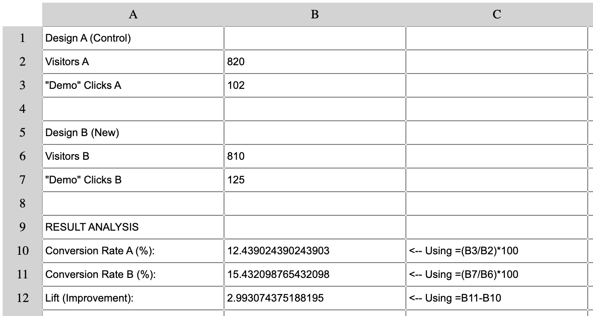

import Tabs from '@theme/Tabs';
import TabItem from '@theme/TabItem';

# Spreadsheet

<table>
  <tr>
    <td>
      
    </td>
  </tr>
  <tr>
    <td align="center">
      <i>Practical example of the Spreadsheet analyzing usability test data.</i>
    </td>
  </tr>
</table>
The data entered simulate completion times (in seconds) and errors made by 5 users testing a new feature (for example, a checkout process).
The Mean (93s) and Median (90s) of completion times are very close. This is an excellent signal, because it indicates a consistent and predictable user experience, without extreme outliers that would distort the average. <br />
Total Errors (5) are analyzed together with times, revealing a key insight: the user with the longest time (110s) was also the one who made the most errors (3).
In a real context, this result provides a clear next step: the UX team should immediately review the session recording of that specific user (User 3) to identify the design flaw that caused both the delay and the errors, leading to targeted optimization.

<br />
<table>
  <tr>
    <td align="center">
      
    </td>
  </tr>
  <tr>
    <td align="center">
      <i>Practical example of the Spreadsheet used to quickly analyze A/B Test results.</i> 
    </td>
  </tr>
</table>

This simulation compares two designs: "Design A" (the original Control) and "Design B" (the New version), to see which of the two has a better Conversion Rate for the "Request Demo" button.
The spreadsheet calculates the Conversion Rate for both, showing Design A at 12.4% and Design B at 15.4%. This metric is crucial because it measures the persuasive strength of each design.<br />
The key metric "Lift (Improvement)" shows that Design B performs ~3 percentage points higher than the original.
This provides clear, data-driven validation. The insight from this spreadsheet is a clear recommendation to replace Design A with Design B, since the new design is clearly more effective at converting users.

### The Project
Functional spreadsheet developed with pure JavaScript, implementing advanced functions such as sums, averages, medians, ranges and formula evaluation. A project that demonstrates functional programming principles applied to a real-world use case.

### Source Code

<Tabs>
<TabItem value="html" label="index.html" default>

```html
<!DOCTYPE html>
<html lang="en">
  <head>
    <meta charset="utf-8" />
    <meta name="viewport" content="width=device-width, initial-scale=1" />
    <title>Functional Programming Spreadsheet</title>
    <link rel="stylesheet" href="styles.css">
  </head>
  <body>
    <div id="container">
      <div></div>
    </div>
  </body>
</html>
```
</TabItem>

<TabItem value="css" label="styles.css">

```css
#container {
  display: grid;
  grid-template-columns: 50px repeat(10, 200px);
  grid-template-rows: repeat(11, 30px);
}

.label {
  background-color: lightgray;
  text-align: center;
  vertical-align: middle;
  line-height: 30px;
}
```
</TabItem>

<TabItem value="js" label="script.js">

```js
const infixToFunction = {
  "+": (x, y) => x + y,
  "-": (x, y) => x - y,
  "*": (x, y) => x * y,
  "/": (x, y) => x / y,
}

const infixEval = (str, regex) => str.replace(regex, (_match, arg1, operator, arg2) => infixToFunction[operator](parseFloat(arg1), parseFloat(arg2)));

const highPrecedence = str => {
  const regex = /([\d.]+)([*\/])([\d.]+)/;
  const str2 = infixEval(str, regex);
  return str === str2 ? str : highPrecedence(str2);
}

const isEven = num => num % 2 === 0;
const sum = nums => nums.reduce((acc, el) => acc + el, 0);
const average = nums => sum(nums) / nums.length;

const median = nums => {
  const sorted = nums.slice().sort((a, b) => a - b);
  const length = sorted.length;
  const middle = length / 2 - 1;
  return isEven(length)
    ? average([sorted[middle], sorted[middle + 1]])
    : sorted[Math.ceil(middle)];
}

const spreadsheetFunctions = {
  "" : (nums) => nums,
  sum,
  average,
  median,
  even: nums => nums.filter(isEven),
  someeven: nums => nums.some(isEven),
  everyeven: nums => nums.every(isEven),
  firsttwo: nums => nums.slice(0, 2),
  lasttwo: nums => nums.slice(-2),
  has2: nums => nums.includes(2),
  increment: nums => nums.map(num => num + 1),
  random: ([x, y]) => Math.floor(Math.random() * y + x),
  range: nums => range(...nums),
  nodupes: nums => [...new Set(nums).values()]
}

const applyFunction = str => {
  const noHigh = highPrecedence(str);
  const infix = /([\d.]+)([+-])([\d.]+)/;
  const str2 = infixEval(noHigh, infix);
  const functionCall = /([a-z0-9]*)\(([0-9., ]*)\)(?!.*\()/i;
  const toNumberList = args => args.split(",").map(parseFloat);
  const apply = (fn, args) => spreadsheetFunctions[fn.toLowerCase()](toNumberList(args));
  return str2.replace(functionCall, (match, fn, args) => spreadsheetFunctions.hasOwnProperty(fn.toLowerCase()) ? apply(fn, args) : match);
}

const range = (start, end) => Array(end - start + 1).fill(start).map((element, index) => element + index);
const charRange = (start, end) => range(start.charCodeAt(0), end.charCodeAt(0)).map(code => String.fromCharCode(code));

const evalFormula = (x, cells) => {
  const idToText = id => cells.find(cell => cell.id === id).value;
  const rangeRegex = /([A-J])([1-9][0-9]?):([A-J])([1-9][0-9]?)/gi;
  const rangeFromString = (num1, num2) => range(parseInt(num1), parseInt(num2));
  const elemValue = num => character => idToText(character + num);
  const addCharacters = character1 => character2 => num => charRange(character1, character2).map(elemValue(num));
  const rangeExpanded = x.replace(rangeRegex, (_match, char1, num1, char2, num2) => rangeFromString(num1, num2).map(addCharacters(char1)(char2)));
  const cellRegex = /[A-J][1-9][0-9]?/gi;
  const cellExpanded = rangeExpanded.replace(cellRegex, match => idToText(match.toUpperCase()));
  const functionExpanded = applyFunction(cellExpanded);
  return functionExpanded === x ? functionExpanded : evalFormula(functionExpanded, cells);
}

window.onload = () => {
  const container = document.getElementById("container");
  const createLabel = (name) => {
    const label = document.createElement("div");
    label.className = "label";
    label.textContent = name;
    container.appendChild(label);
  }
  const letters = charRange("A", "J");
  letters.forEach(createLabel);
  range(1, 99).forEach(number => {
    createLabel(number);
    letters.forEach(letter => {
      const input = document.createElement("input");
      input.type = "text";
      input.id = letter + number;
      input.ariaLabel = letter + number;
      input.onchange = update;
      container.appendChild(input);
    })
  })
}

const update = event => {
  const element = event.target;
  const value = element.value.replace(/\s/g, "");
  if (!value.includes(element.id) && value.startsWith('=')) {
    element.value = evalFormula(value.slice(1), Array.from(document.getElementById("container").children));
  }
}
```

</TabItem> 

<TabItem value="commented" label="explained">

```html
<!DOCTYPE html>
<!-- 🎯 HTML5 DECLARATION: "Welcome to homemade Excel!" -->
<!-- It's like opening the doors of a digital accounting office! 📊 -->

<html lang="en">
<!-- 🌍 MAIN CONTAINER: Our web spreadsheet -->
<!-- lang="en" = English, the universal language of numbers! 💰 -->

  <head>
    <!-- 🧠 THE MATH BRAIN: Where we prepare the formulas -->
    <!-- It's like the back of a calculator where the circuits live! -->
    
    <meta charset="utf-8" />
    <!-- 📝 UNIVERSAL CHARACTERS: UTF-8 for numbers and mathematical symbols ∑∏∫ -->
    
    <meta name="viewport" content="width=device-width, initial-scale=1" />
    <!-- 📱 RESPONSIVE DESIGN: "The spreadsheet adapts to every screen!" -->
    <!-- It's like having a notebook that magically changes size -->
    
    <title>Functional Programming Spreadsheet</title>
    <!-- 📑 TITLE: A spreadsheet that uses functional programming! -->
    
    <style>
      /* 🎨 ===== STYLES FOR OUR EXCEL ===== */
      
      #container {
        display: grid;
        /* 🎯 CSS GRID: The perfect layout for a spreadsheet! */
        
        grid-template-columns: 50px repeat(10, 200px);
        /* 📏 COLUMNS: First column 50px (for row numbers), then 10 columns of 200px */
        /* repeat(10, 200px) = repeat "200px" 10 times */
        /* It's like saying: narrow labels, wide cells for data */
        
        grid-template-rows: repeat(11, 30px);
        /* 📐 ROWS: 11 rows of 30px each */
        /* First row for letters A-J, then 10 rows for data */
      }
      
      .label {
        background-color: lightgray;
        /* 🔘 GRAY BACKGROUND: To distinguish labels */
        
        text-align: center;
        /* ⚖️ CENTERED TEXT: Letters and numbers centered */
        
        vertical-align: middle;
        /* 📐 VERTICAL ALIGNMENT: Center vertically */
        
        line-height: 30px;
        /* 📏 LINE HEIGHT: Trick to vertically center! */
        /* line-height = row height = centers perfectly */
      }
    </style>
  </head>
  
  <body>
    <!-- 📊 ===== THE SPREADSHEET COMES TO LIFE! ===== -->
    
    <div id="container">
      <!-- 📦 GRID CONTAINER: Everything will be built here dynamically -->
      <div></div>
      <!-- 📐 EMPTY DIV: For the top-left corner (above the row numbers) -->
    </div>
    
    <script>
      /* 🧮 ===== THE MATHEMATICAL ENGINE OF THE SPREADSHEET ===== */
      
      const infixToFunction = {
        "+": (x, y) => x + y,
        "-": (x, y) => x - y,
        "*": (x, y) => x * y,
        "/": (x, y) => x / y,
      }
      /* 🔢 OPERATOR DICTIONARY: Maps symbols to mathematical functions */
      /* It's like having a manual that says: */
      /* "+" means "add these two numbers" */
      /* "-" means "subtract the second from the first" */
      /* Arrow function (x, y) => x + y is like saying "take x and y, return the sum" */
      
      const infixEval = (str, regex) => str.replace(regex, (_match, arg1, operator, arg2) => infixToFunction[operator](parseFloat(arg1), parseFloat(arg2)));
      /* 🎯 EXPRESSION EVALUATOR: Finds math patterns and computes them! */
      /* str.replace(regex, callback) = find the pattern and replace it */
      /* _match = the entire match (underscore indicates we don't use it) */
      /* arg1, operator, arg2 = captured pieces from the regex (e.g. "5", "+", "3") */
      /* parseFloat() = convert string to decimal number */
      /* It's like a robot that finds "5+3" and replaces it with "8" */
      
      const highPrecedence = str => {
        const regex = /([\d.]+)([*\\/])([\d.]+)/;
        /* 📐 REGEX FOR MULTIPLICATION/DIVISION: */
        /* ([\d.]+) = one or more digits/dots (first number) */
        /* ([*\\/]) = * or / (operator) */
        /* ([\d.]+) = second number */
        /* Finds patterns like "5*3" or "10/2" */
        
        const str2 = infixEval(str, regex);
        /* 🔄 EVALUATE: Apply multiplications and divisions */
        
        return str === str2 ? str : highPrecedence(str2);
        /* 🔁 RECURSION: If nothing changed, we're done! Otherwise, continue */
        /* It's like saying: "keep doing * and / until none remain" */
        /* Recursion = the function calls itself */
      }
      
      /* 🧮 ===== BASIC MATH FUNCTIONS ===== */
      
      const isEven = num => num % 2 === 0;
      /* 🔢 IS IT EVEN?: num % 2 = remainder of division by 2 */
      /* If remainder is 0, the number is even! */
      /* 4 % 2 = 0 (even), 5 % 2 = 1 (odd) */
      
      const sum = nums => nums.reduce((acc, el) => acc + el, 0);
      /* ➕ SUM: reduce() accumulates all values */
      /* acc = accumulator (starts at 0) */
      /* el = current element */
      /* It's like having a calculator that presses + for every number */
      
      const average = nums => sum(nums) / nums.length;
      /* 📊 AVERAGE: Sum all and divide by how many there are */
      /* It's the classic arithmetic mean we used in school! */
      
      const median = nums => {
        const sorted = nums.slice().sort((a, b) => a - b);
        /* 🔄 COPY AND SORT: slice() creates a copy, sort() orders it */
        /* (a, b) => a - b sorts in ascending order */
        /* We don't modify the original array! */
        
        const length = sorted.length;
        const middle = length / 2 - 1;
        /* 📍 FIND THE CENTER: -1 because arrays start at 0 */
        
        return isEven(length)
          ? average([sorted[middle], sorted[middle + 1]])
          : sorted[Math.ceil(middle)];
        /* 🎯 MEDIAN: */
        /* If even: average of the two central values */
        /* If odd: the central one */
        /* Math.ceil() = round up */
      }
      
      /* 📚 ===== DICTIONARY OF SPREADSHEET FUNCTIONS ===== */
      
      const spreadsheetFunctions = {
        "" : (nums) => nums,
        /* 🔄 EMPTY FUNCTION: Returns numbers as they are */
        
        sum,
        /* ➕ SUM: Uses the function defined above */
        /* Shorthand for sum: sum (instead of sum: sum) */
        
        average,
        /* 📊 AVERAGE: Arithmetic mean */
        
        median,
        /* 📈 MEDIAN: Central value */
        
        even: nums => nums.filter(isEven),
        /* 🔢 ONLY EVENS: filter() keeps only those that pass the test */
        
        someeven: nums => nums.some(isEven),
        /* ❓ AT LEAST ONE EVEN?: some() = true if at least one is even */
        
        everyeven: nums => nums.every(isEven),
        /* ✅ ALL EVEN?: every() = true only if ALL are even */
        
        firsttwo: nums => nums.slice(0, 2),
        /* ✌️ FIRST TWO: slice(0, 2) = from index 0 to 2 (excluded) */
        
        lasttwo: nums => nums.slice(-2),
        /* 🔚 LAST TWO: slice(-2) = the last 2 elements */
        /* Negative indices start from the end! */
        
        has2: nums => nums.includes(2),
        /* 🔍 CONTAINS 2?: includes() looks for a specific value */
        
        increment: nums => nums.map(num => num + 1),
        /* ➕1️⃣ INCREMENT: map() transforms each element */
        /* Adds 1 to every number */
        
        random: ([x, y]) => Math.floor(Math.random() * y + x),
        /* 🎲 RANDOM NUMBER: Between x and y */
        /* [x, y] = destructuring, takes the first two elements */
        /* Math.random() = number between 0 and 1 */
        /* Math.floor() = round down */
        
        range: nums => range(...nums),
        /* 🔢 SEQUENCE: Creates a range of numbers */
        /* ...nums = spread operator, "unpacks" the array */
        
        nodupes: nums => [...new Set(nums).values()]
        /* 🚫 NO DUPLICATES: Set automatically removes duplicates! */
        /* [...] = spread to convert back to array */
        /* It's like passing the numbers through a sieve that keeps only one of each */
      }
      
      /* 🎯 ===== FUNCTION APPLICATOR ===== */
      
      const applyFunction = str => {
        const noHigh = highPrecedence(str);
        /* 🥇 PRIORITIES FIRST: Solve * and / before + and - */
        
        const infix = /([\d.]+)([+-])([\d.]+)/;
        /* 📐 ADDITION/SUBTRACTION REGEX: Pattern for + and - */
        
        const str2 = infixEval(noHigh, infix);
        /* 🔄 EVALUATE: Now solve + and - */
        
        const functionCall = /([a-z0-9]*)\(([0-9., ]*)\)(?!.*\()/i;
        /* 🔍 FUNCTION CALL REGEX: */
        /* ([a-z0-9]*) = function name (letters/numbers) */
        /* \( = literal open parenthesis */
        /* ([0-9., ]*) = arguments (numbers, commas, spaces) */
        /* \) = closing parenthesis */
        /* (?!.*\() = negative lookahead: there must not be another ( after */
        /* i at the end = case insensitive */
        /* Finds the last nested function to evaluate */
        
        const toNumberList = args => args.split(",").map(parseFloat);
        /* 🔢 CONVERT TO NUMBERS: "1,2,3" becomes [1, 2, 3] */
        /* split(",") = split on comma */
        /* map(parseFloat) = convert each piece to a number */
        
        const apply = (fn, args) => spreadsheetFunctions[fn.toLowerCase()](toNumberList(args));
        /* 🎯 APPLY FUNCTION: */
        /* toLowerCase() = sum, SUM, Sum are all the same */
        /* Looks up the function in the dictionary and executes it */
        
        return str2.replace(functionCall, (match, fn, args) => 
          spreadsheetFunctions.hasOwnProperty(fn.toLowerCase()) ? apply(fn, args) : match
        );
        /* 🔄 REPLACE: If the function exists, compute it; otherwise leave as is */
        /* hasOwnProperty() = checks if the property exists */
        /* ? : = ternary operator (inline if) */
      }
      
      /* 🔢 ===== RANGE GENERATORS ===== */
      
      const range = (start, end) => Array(end - start + 1).fill(start).map((element, index) => element + index);
      /* 🔢 CREATE NUMERIC SEQUENCE: From start to end (inclusive) */
      /* Array(n) = creates an array of n elements */
      /* fill(start) = fill everything with start */
      /* map((el, i) => el + i) = transform each element to start + position */
      /* range(5, 8) = [5, 6, 7, 8] */
      /* It's like counting on your fingers from start to end! */
      
      const charRange = (start, end) => range(start.charCodeAt(0), end.charCodeAt(0)).map(code => String.fromCharCode(code));
      /* 🔤 CREATE LETTER SEQUENCE: From start to end */
      /* charCodeAt(0) = ASCII code of the first letter */
      /* String.fromCharCode() = from ASCII code to letter */
      /* charRange("A", "D") = ["A", "B", "C", "D"] */
      /* It's like reciting the alphabet from one letter to another! */
      
      /* 🧮 ===== THE HEART: FORMULA EVALUATOR ===== */
      
      const evalFormula = (x, cells) => {
        const idToText = id => cells.find(cell => cell.id === id).value;
        /* 🔍 FIND CELL VALUE: Look up the cell with that ID and take its value */
        /* find() = finds the first element that satisfies the condition */
        
        const rangeRegex = /([A-J])([1-9][0-9]?):([A-J])([1-9][0-9]?)/gi;
        /* 📐 RANGE REGEX: A1:B3 */
        /* ([A-J]) = first letter (A-J) */
        /* ([1-9][0-9]?) = number 1-99 (? = optional) */
        /* : = literal colon */
        /* Same for the second cell */
        /* gi = global (all matches) + case insensitive */
        
        const rangeFromString = (num1, num2) => range(parseInt(num1), parseInt(num2));
        /* 🔢 NUMBERS FROM STRING: "1" and "3" become [1, 2, 3] */
        
        const elemValue = num => character => idToText(character + num);
        /* 🎯 ELEMENT VALUE: Curried function! */
        /* First take the number, then the letter, then find the value */
        /* elemValue(1)("A") = value of cell A1 */
        /* Currying = a function that returns a function */
        
        const addCharacters = character1 => character2 => num => 
          charRange(character1, character2).map(elemValue(num));
        /* 🔤 ADD CHARACTERS: Triple curry! */
        /* addCharacters("A")("C")(1) = values of A1, B1, C1 */
        /* It's like a chain of function assembly lines */
        
        const rangeExpanded = x.replace(rangeRegex, (_match, char1, num1, char2, num2) => 
          rangeFromString(num1, num2).map(addCharacters(char1)(char2))
        );
        /* 🔄 EXPAND RANGE: A1:B2 becomes A1,B1,A2,B2 */
        /* Transforms ranges into lists of cells */
        
        const cellRegex = /[A-J][1-9][0-9]?/gi;
        /* 📐 SINGLE CELL REGEX: A1, B2, etc. */
        
        const cellExpanded = rangeExpanded.replace(cellRegex, match => 
          idToText(match.toUpperCase())
        );
        /* 🔄 REPLACE CELLS: A1 becomes its value */
        
        const functionExpanded = applyFunction(cellExpanded);
        /* 🎯 APPLY FUNCTIONS: Compute sum(), average(), etc. */
        
        return functionExpanded === x ? functionExpanded : evalFormula(functionExpanded, cells);
        /* 🔁 RECURSION: If nothing changed, we're done! */
        /* Otherwise, keep evaluating */
        /* It's like peeling an onion layer by layer */
      }
      
      /* 🚀 ===== INITIALIZATION ON LOAD ===== */
      
      window.onload = () => {
        /* 🎬 WHEN THE PAGE IS READY: Build the spreadsheet */
        
        const container = document.getElementById("container");
        /* 📦 GET THE CONTAINER: Where we'll build everything */
        
        const createLabel = (name) => {
          const label = document.createElement("div");
          /* 🏷️ CREATE LABEL: A div for each letter/number */
          
          label.className = "label";
          /* 🎨 ADD CLASS: For CSS styling */
          
          label.textContent = name;
          /* 📝 INSERT TEXT: The letter or the number */
          
          container.appendChild(label);
          /* 📎 ATTACH TO CONTAINER: Add to the DOM */
        }
        
        const letters = charRange("A", "J");
        /* 🔤 GENERATE LETTERS: ["A", "B", ..., "J"] */
        
        letters.forEach(createLabel);
        /* 🔄 CREATE COLUMN LABELS: One for each letter */
        
        range(1, 99).forEach(number => {
          /* 🔢 FOR EACH ROW (1-99): */
          
          createLabel(number);
          /* 🏷️ CREATE ROW LABEL: The number on the left */
          
          letters.forEach(letter => {
            /* 🔤 FOR EACH COLUMN: */
            
            const input = document.createElement("input");
            /* 📝 CREATE INPUT CELL: Where the user types */
            
            input.type = "text";
            /* 📝 TEXT TYPE: Can contain numbers or formulas */
            
            input.id = letter + number;
            /* 🆔 UNIQUE ID: "A1", "B2", etc. */
            
            input.ariaLabel = letter + number;
            /* ♿ ACCESSIBILITY: Screen reader will read "A1" */
            
            input.onchange = update;
            /* 🔄 CHANGE EVENT: When the user finishes typing */
            
            container.appendChild(input);
            /* 📎 ADD TO DOM: The cell is ready! */
          })
        })
      }
      
      /* 🔄 ===== UPDATE CELLS ===== */
      
      const update = event => {
        const element = event.target;
        /* 🎯 CHANGED ELEMENT: The cell the user modified */
        
        const value = element.value.replace(/\s/g, "");
        /* 🧹 CLEAN: Remove all whitespace */
        /* /\s/g = regex for spaces, g = global */
        
        if (!value.includes(element.id) && value.startsWith('=')) {
          /* 🔍 FORMULA CHECK: */
          /* !value.includes(element.id) = it does not reference itself (no circular!) */
          /* value.startsWith('=') = it's a formula */
          
          element.value = evalFormula(value.slice(1), Array.from(document.getElementById("container").children));
          /* 🧮 COMPUTE: */
          /* value.slice(1) = remove the initial = */
          /* Array.from() = convert HTMLCollection to array */
          /* .children = all children of the container (labels and inputs) */
          /* The result replaces the formula in the cell! */
        }
      }
      
      /* 🎯 ===== HOW OUR EXCEL WORKS ===== */
      /* 1. The user writes "=sum(A1:A3)" in a cell */
      /* 2. update() intercepts the change */
      /* 3. evalFormula() expands A1:A3 into A1,A2,A3 */
      /* 4. It replaces each cell with its value */
      /* 5. applyFunction() finds sum() and computes it */
      /* 6. The result appears in the cell! */
      /* It's functional programming magic! 🎩✨ */
    </script>
  </body>
</html>
```
</TabItem>

</Tabs>


### The Breakthrough: When Currying "Clicked"

It was really interesting to encounter **currying with arrow functions** for the first time.
At first it just seemed like strange syntax: `character1 => character2 => num => ...`. Even 3 arrows?<br />
Now I consider it a very simple concept, but initially it wasn't at all. Because it involved cognitively restructuring a concept I had by then taken for granted: arrow functions.<br />
I will summarize below all the analogies and explanations that the Code Tutor provided to help me understand the concept.

#### The Factory Analogy

A normal function is like a machine that needs all keys inserted simultaneously:
```javascript
const add = (a, b) => a + b; // You have to give it a and b immediately
```

A curried function is instead a **factory of specialized machines**:
```javascript
const curriedAdd = a => b => a + b;
```

- `curriedAdd(10)`: Doesn't give you a result. It gives you a new machine with 10 "welded" inside.
- `const add10 = curriedAdd(10)`: You save this specialized machine.
- `add10(5)`: Now you use the machine. Result: 15.

This means that each level "locks" a piece of information and passes a new function to the next level. It's **closure** at work, so each function "remembers" (keeps in memory) the parameters received at higher levels.

#### The .zip File vs The Folder 📦

I continued through the exercises, but after making a completely avoidable error I decided to delve deeper: both because I didn't want to make similar mistakes, and because I didn't want any gaps in my understanding.<br />
Here's the analogy that was most effective for me:

**Long Version (The Folder 📁):**
```javascript
const elemValue = num => {
  const inner = character => idToText(character + num);
  return inner;
}
```
It's a folder. You can open it, add `console.log` in it for debugging, inspect it.

**Short Version (The .zip File 📦):**
```javascript
const elemValue = num => character => idToText(character + num);
```
It's a compressed file. It contains exactly the same thing, but without "noise" (`const`, `return`, `{}`). It therefore shows only the pure logic.<br />
At that point I wondered: "The compact solution is certainly more elegant and, paradoxically, once you understand how it works it's even more readable than the extended version. Is the price you pay poor scalability?"

After some research, here's what emerged in terms of "ideal workflow":
1. I write the short version for elegance
2. If there's a bug, I "decompress" into the long version
3. I add `console.log` for debugging
4. I solve the problem
5. I "recompress" into the short version

### What I Learned

**Advanced Functional Programming:**
- **Currying:** Functions that return functions, creating progressive specializations.
- **Closure:** Inner functions keep outer function variables in memory.
- **Partial Application:** Locking some arguments to create new functions on the fly.
- **Pure Functions:** Functions without side effects that facilitate debugging and testing.

**Advanced JavaScript Syntax:**
- Implicit return with arrow functions: `x => y` equals `x => { return y }`.
- Multi-level currying: `a => b => c => result`.
- Destructuring and pattern matching with advanced regex.

**String and Regex Manipulation:**
- Formula evaluation with complex regex for mathematical operations.
- Pattern `/([A-J])([1-9][0-9]?):([A-J])([1-9][0-9]?)/gi` to handle cell ranges.
- Recursive replacement with `.replace()` to expand nested formulas.

**Array Methods and Composition:**
- `.reduce()`, `.map()`, `.filter()`, `.some()`, `.every()`, `.slice()` in functional contexts.
- Function composition to create data transformation pipelines.
- `new Set()` to remove duplicates.

**Statistical Algorithms:**
- Implementation of `sum`, `average`, `median` with functional approach.
- Handling even/odd arrays for median calculation.

**Spreadsheet Architecture:**
- Cell identification system (A1, B2, etc.).
- Recursive formula evaluation with cell dependencies.
- Circular reference prevention.

### Reflection

Now when I encounter a syntax like `num => character => idToText(character + num)`, my brain no longer reads code, it reads a flow: "I take `num`, which leads me to a function that takes `character`, which leads me to the final result."<br />
The `=>` syntax has become a **visual flow diagram** for me. Every time I encountered it subsequently, I said to myself "leads to...", as if I were following a map. No more parentheses, returns and temporary variables to keep in mind, just the pure transformation of data, step by step.

---

**Next Project**: Build a Telephone Number Validator Project (CERTIFICATION PROJECT!)