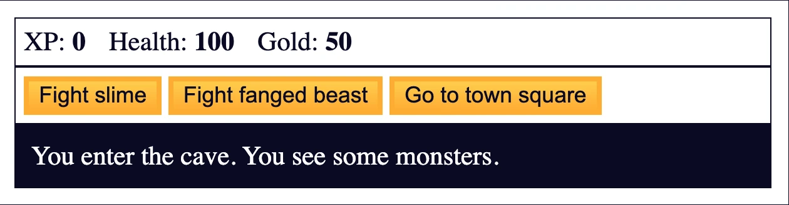
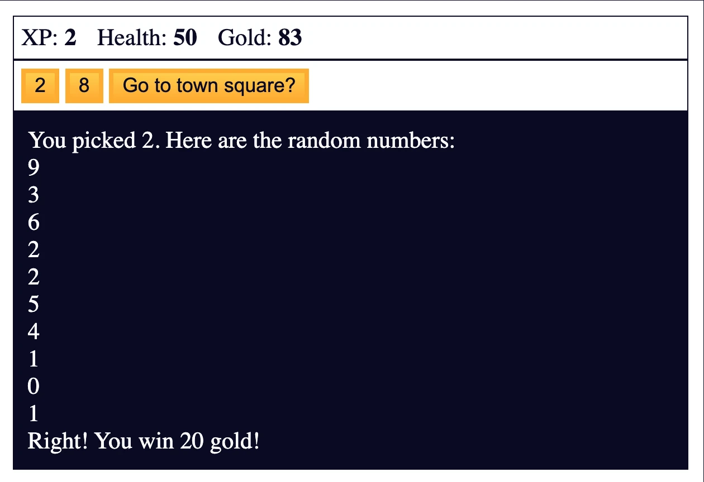

import Tabs from '@theme/Tabs';
import TabItem from '@theme/TabItem';

# Role Playing Game







### The Project

Dragon Repeller RPG developed by integrating JavaScript with HTML and CSS, featuring combat system, inventory management, multiple locations and complete game mechanics. The first project that combines logic, interface and user interaction.

### Source Code

<Tabs>
<TabItem value="html" label="index.html" default>

```html
<!DOCTYPE html>
<html lang="en">
  <head>
    <meta charset="utf-8">
    <link rel="stylesheet" href="./styles.css">
    <title>RPG - Dragon Repeller</title>
  </head>
  <body>
    <div id="game">
      <div id="stats">
        <span class="stat">XP: <strong><span id="xpText">0</span></strong></span>
        <span class="stat">Health: <strong><span id="healthText">100</span></strong></span>
        <span class="stat">Gold: <strong><span id="goldText">50</span></strong></span>
      </div>
      <div id="controls">
        <button id="button1">Go to store</button>
        <button id="button2">Go to cave</button>
        <button id="button3">Fight dragon</button>
      </div>
      <div id="monsterStats">
        <span class="stat">Monster Name: <strong><span id="monsterName"></span></strong></span>
        <span class="stat">Health: <strong><span id="monsterHealth"></span></strong></span>
      </div>
      <div id="text">
        Welcome to Dragon Repeller. You must defeat the dragon that is preventing people from leaving the town. You are in the town square. Where do you want to go? Use the buttons above.
      </div>
    </div>
    <script src="./script.js"></script>
  </body>
</html>
```
</TabItem>

<TabItem value="css" label="styles.css">

```css
body {
  background-color: #0a0a23;
}

#text {
  background-color: #0a0a23;
  color: #ffffff;
  padding: 10px;
}

#game {
  max-width: 500px;
  max-height: 400px;
  background-color: #ffffff;
  color: #ffffff;
  margin: 30px auto 0px;
  padding: 10px;
}

#controls,
#stats {
  border: 1px solid #0a0a23;
  padding: 5px;
  color: #0a0a23;
}

#monsterStats {
  display: none;
  border: 1px solid #0a0a23;
  padding: 5px;
  color: #ffffff;
  background-color: #c70d0d;
}

.stat {
  padding-right: 10px;
}

button {
  cursor: pointer;
  color: #0a0a23;
  background-color: #feac32;
  background-image: linear-gradient(#fecc4c, #ffac33);
  border: 3px solid #feac32;
}
```
</TabItem>

<TabItem value="js" label="script.js">

```js
let xp = 0;
let health = 100;
let gold = 50;
let currentWeapon = 0;
let fighting;
let monsterHealth;
let inventory = ["stick"];

const button1 = document.querySelector('#button1');
const button2 = document.querySelector("#button2");
const button3 = document.querySelector("#button3");
const text = document.querySelector("#text");
const xpText = document.querySelector("#xpText");
const healthText = document.querySelector("#healthText");
const goldText = document.querySelector("#goldText");
const monsterStats = document.querySelector("#monsterStats");
const monsterName = document.querySelector("#monsterName");
const monsterHealthText = document.querySelector("#monsterHealth");
const weapons = [
  { name: 'stick', power: 5 },
  { name: 'dagger', power: 30 },
  { name: 'claw hammer', power: 50 },
  { name: 'sword', power: 100 }
];
const monsters = [
  {
    name: "slime",
    level: 2,
    health: 15
  },
  {
    name: "fanged beast",
    level: 8,
    health: 60
  },
  {
    name: "dragon",
    level: 20,
    health: 300
  }
]
const locations = [
  {
    name: "town square",
    "button text": ["Go to store", "Go to cave", "Fight dragon"],
    "button functions": [goStore, goCave, fightDragon],
    text: "You are in the town square. You see a sign that says \"Store\"."
  },
  {
    name: "store",
    "button text": ["Buy 10 health (10 gold)", "Buy weapon (30 gold)", "Go to town square"],
    "button functions": [buyHealth, buyWeapon, goTown],
    text: "You enter the store."
  },
  {
    name: "cave",
    "button text": ["Fight slime", "Fight fanged beast", "Go to town square"],
    "button functions": [fightSlime, fightBeast, goTown],
    text: "You enter the cave. You see some monsters."
  },
  {
    name: "fight",
    "button text": ["Attack", "Dodge", "Run"],
    "button functions": [attack, dodge, goTown],
    text: "You are fighting a monster."
  },
  {
    name: "kill monster",
    "button text": ["Go to town square", "Go to town square", "Go to town square"],
    "button functions": [goTown, goTown, easterEgg],
    text: 'The monster screams "Arg!" as it dies. You gain experience points and find gold.'
  },
  {
    name: "lose",
    "button text": ["REPLAY?", "REPLAY?", "REPLAY?"],
    "button functions": [restart, restart, restart],
    text: "You die. &#x2620;"
  },
  { 
    name: "win", 
    "button text": ["REPLAY?", "REPLAY?", "REPLAY?"], 
    "button functions": [restart, restart, restart], 
    text: "You defeat the dragon! YOU WIN THE GAME! &#x1F389;" 
  },
  {
    name: "easter egg",
    "button text": ["2", "8", "Go to town square?"],
    "button functions": [pickTwo, pickEight, goTown],
    text: "You find a secret game. Pick a number above. Ten numbers will be randomly chosen between 0 and 10. If the number you choose matches one of the random numbers, you win!"
  }
];

// initialize buttons
button1.onclick = goStore;
button2.onclick = goCave;
button3.onclick = fightDragon;

function update(location) {
  monsterStats.style.display = "none";
  button1.innerText = location["button text"][0];
  button2.innerText = location["button text"][1];
  button3.innerText = location["button text"][2];
  button1.onclick = location["button functions"][0];
  button2.onclick = location["button functions"][1];
  button3.onclick = location["button functions"][2];
  text.innerHTML = location.text;
}

function goTown() {
  update(locations[0]);
}

function goStore() {
  update(locations[1]);
}

function goCave() {
  update(locations[2]);
}

function buyHealth() {
  if (gold >= 10) {
    gold -= 10;
    health += 10;
    goldText.innerText = gold;
    healthText.innerText = health;
  } else {
    text.innerText = "You do not have enough gold to buy health.";
  }
}

function buyWeapon() {
  if (currentWeapon < weapons.length - 1) {
    if (gold >= 30) {
      gold -= 30;
      currentWeapon++;
      goldText.innerText = gold;
      let newWeapon = weapons[currentWeapon].name;
      text.innerText = "You now have a " + newWeapon + ".";
      inventory.push(newWeapon);
      text.innerText += " In your inventory you have: " + inventory;
    } else {
      text.innerText = "You do not have enough gold to buy a weapon.";
    }
  } else {
    text.innerText = "You already have the most powerful weapon!";
    button2.innerText = "Sell weapon for 15 gold";
    button2.onclick = sellWeapon;
  }
}

function sellWeapon() {
  if (inventory.length > 1) {
    gold += 15;
    goldText.innerText = gold;
    let currentWeapon = inventory.shift();
    text.innerText = "You sold a " + currentWeapon + ".";
    text.innerText += " In your inventory you have: " + inventory;
  } else {
    text.innerText = "Don't sell your only weapon!";
  }
}

function fightSlime() {
  fighting = 0;
  goFight();
}

function fightBeast() {
  fighting = 1;
  goFight();
}

function fightDragon() {
  fighting = 2;
  goFight();
}

function goFight() {
  update(locations[3]);
  monsterHealth = monsters[fighting].health;
  monsterStats.style.display = "block";
  monsterName.innerText = monsters[fighting].name;
  monsterHealthText.innerText = monsterHealth;
}

function attack() {
  text.innerText = "The " + monsters[fighting].name + " attacks.";
  text.innerText += " You attack it with your " + weapons[currentWeapon].name + ".";
  health -= getMonsterAttackValue(monsters[fighting].level);
  if (isMonsterHit()) {
    monsterHealth -= weapons[currentWeapon].power + Math.floor(Math.random() * xp) + 1;    
  } else {
    text.innerText += " You miss.";
  }
  healthText.innerText = health;
  monsterHealthText.innerText = monsterHealth;
  if (health <= 0) {
    lose();
  } else if (monsterHealth <= 0) {
    if (fighting === 2) {
      winGame();
    } else {
      defeatMonster();
    }
  }
  if (Math.random() <= .1 && inventory.length !== 1) {
    text.innerText += " Your " + inventory.pop() + " breaks.";
    currentWeapon--;
  }
}

function getMonsterAttackValue(level) {
  const hit = (level * 5) - (Math.floor(Math.random() * xp));
  console.log(hit);
  return hit > 0 ? hit : 0;
}

function isMonsterHit() {
  return Math.random() > .2 || health < 20;
}

function dodge() {
  text.innerText = "You dodge the attack from the " + monsters[fighting].name;
}

function defeatMonster() {
  gold += Math.floor(monsters[fighting].level * 6.7);
  xp += monsters[fighting].level;
  goldText.innerText = gold;
  xpText.innerText = xp;
  update(locations[4]);
}

function lose() {
  update(locations[5]);
}

function winGame() {
  update(locations[6]);
}

function restart() {
  xp = 0;
  health = 100;
  gold = 50;
  currentWeapon = 0;
  inventory = ["stick"];
  goldText.innerText = gold;
  healthText.innerText = health;
  xpText.innerText = xp;
  goTown();
}

function easterEgg() {
  update(locations[7]);
}

function pickTwo() {
  pick(2);
}

function pickEight() {
  pick(8);
}

function pick(guess) {
  const numbers = [];
  while (numbers.length < 10) {
    numbers.push(Math.floor(Math.random() * 11));
  }
  text.innerText = "You picked " + guess + ". Here are the random numbers:\n";
  for (let i = 0; i < 10; i++) {
    text.innerText += numbers[i] + "\n";
  }
  if (numbers.includes(guess)) {
    text.innerText += "Right! You win 20 gold!";
    gold += 20;
    goldText.innerText = gold;
  } else {
    text.innerText += "Wrong! You lose 10 health!";
    health -= 10;
    healthText.innerText = health;
    if (health <= 0) {
      lose();
    }
  }
}
```

</TabItem> 

<TabItem value="commented" label="explained">

```html
<!DOCTYPE html>
<!-- 🎯 HTML5 DECLARATION: "Welcome to the world of browser RPG games!" -->
<!-- It's like opening the doors of a digital medieval tavern! ⚔️ -->

<html lang="en">
<!-- 🌍 MAIN CONTAINER: Our fantasy kingdom -->
<!-- lang="en" = English, the language of adventurers! 🗡️ -->

<head>
    <!-- 🧠 THE HEADQUARTERS: Where we plan the adventure -->
    
    <meta charset="utf-8">
    <!-- 📝 UNIVERSAL CHARACTERS: For dragons of every language! 🐲 -->
    
    <title>RPG - Dragon Repeller</title>
    <!-- 📑 TAB TITLE: The name of our quest! -->
    
    <style>
        /* 🎨 ===== THE STYLE OF OUR FANTASY GAME ===== */
        
        body {
            background-color: #0a0a23;
            /* 🌑 NIGHT BLUE BACKGROUND: The darkness surrounding the village */
            /* It's freeCodeCamp's classic color! */
        }

        #text {
            background-color: #0a0a23;
            /* 🌑 SAME BACKGROUND: For narrative text */
            
            color: #ffffff;
            /* ⚪ WHITE TEXT: Perfect contrast on dark blue */
            
            padding: 10px;
            /* 🏠 PADDING: Internal space to breathe */
        }

        #game {
            max-width: 500px;
            max-height: 400px;
            /* 📏 MAXIMUM DIMENSIONS: Our game "screen" */
            /* It's like the window of a giant Game Boy! */
            
            background-color: #ffffff;
            /* ⚪ WHITE BACKGROUND: The game canvas */
            
            color: #ffffff;
            /* ⚪ TEXT COLOR: But it will be overridden by children */
            
            margin: 30px auto 0px;
            /* ⚖️ CENTERING: 30px above, auto on the sides, 0 below */
            
            padding: 10px;
            /* 🏠 PADDING: Inner frame */
        }

        #controls,
        #stats {
            /* 🎮 CONTROLS AND STATISTICS: Same style */
            
            border: 1px solid #0a0a23;
            /* 🖼️ DARK BLUE BORDER: Defines sections */
            
            padding: 5px;
            /* 🏠 SMALL PADDING: For control panels */
            
            color: #0a0a23;
            /* 🌑 DARK BLUE TEXT: On white background */
        }

        #monsterStats {
            display: none;
            /* 🙈 INITIALLY HIDDEN: Appears only in battle! */
            
            border: 1px solid #0a0a23;
            padding: 5px;
            color: #ffffff;
            /* ⚪ WHITE TEXT: For contrast */
            
            background-color: #c70d0d;
            /* 🔴 BLOOD RED BACKGROUND: Danger! Monster! */
            /* It's like a battle alert */
        }

        .stat {
            padding-right: 10px;
            /* ➡️ RIGHT SPACE: Separates statistics */
            /* XP: 0   Health: 100   Gold: 50 */
        }

        button {
            cursor: pointer;
            /* 👆 HAND CURSOR: "Click me for adventure!" */
            
            color: #0a0a23;
            /* 🌑 DARK BLUE TEXT: Readable on yellow */
            
            background-color: #feac32;
            /* 🟡 GOLD YELLOW: Like gold coins! */
            
            background-image: linear-gradient(#fecc4c, #ffac33);
            /* 🌟 GOLDEN GRADIENT: From light to dark */
            /* Creates a 3D effect on buttons */
            
            border: 3px solid #feac32;
            /* 🖼️ COORDINATED BORDER: Same base color */
        }
    </style>
</head>
<body>
    <!-- ⚔️ ===== THE GAME COMES TO LIFE! ===== -->
    
    <div id="game">
        <!-- 🎮 GAME CONTAINER: Our "console" -->
        
        <div id="stats">
            <!-- 📊 STATS PANEL: The hero's vital parameters -->
            
            <span class="stat">XP: <strong><span id="xpText">0</span></strong></span>
            <!-- 🌟 EXPERIENCE: Starts at 0, like every novice hero -->
            
            <span class="stat">Health: <strong><span id="healthText">100</span></strong></span>
            <!-- ❤️ HEALTH: 100 HP, full energy! -->
            
            <span class="stat">Gold: <strong><span id="goldText">50</span></strong></span>
            <!-- 💰 GOLD: 50 initial coins to start the adventure -->
        </div>
        
        <div id="controls">
            <!-- 🎮 CONTROL PANEL: Our action buttons -->
            
            <button id="button1">Go to store</button>
            <!-- 🏪 BUTTON 1: Initially leads to the store -->
            
            <button id="button2">Go to cave</button>
            <!-- 🕳️ BUTTON 2: Initially leads to the cave -->
            
            <button id="button3">Fight dragon</button>
            <!-- 🐉 BUTTON 3: Initially challenges the dragon (brave!) -->
        </div>
        
        <div id="monsterStats">
            <!-- 👹 MONSTER STATS: Hidden until you fight -->
            
            <span class="stat">Monster Name: <strong><span id="monsterName"></span></strong></span>
            <!-- 👾 MONSTER NAME: Initially empty -->
            
            <span class="stat">Health: <strong><span id="monsterHealth"></span></strong></span>
            <!-- 💔 MONSTER HEALTH: This is also empty -->
        </div>
        
        <div id="text">
            <!-- 📜 NARRATIVE AREA: Where the story unfolds -->
            Welcome to Dragon Repeller. You must defeat the dragon that is preventing people from leaving the town. You are in the town square. Where do you want to go? Use the buttons above.
            <!-- 🏰 INTRODUCTION: The main quest is clear! -->
        </div>
    </div>

    <script>
        /* 🎮 ===== THE BRAIN OF THE GAME: JavaScript! ===== */
        
        // 🎯 ===== GAME STATE: The Global Variables =====
        
        let xp = 0;
        // 🌟 EXPERIENCE POINTS: The hero starts from level zero
        
        let health = 100;
        // ❤️ HEALTH POINTS: 100 HP, full health!
        
        let gold = 50;
        // 💰 INITIAL GOLD: Enough for a few potions
        
        let currentWeapon = 0;
        // ⚔️ CURRENT WEAPON: Index in the weapons array (0 = stick)
        
        let fighting;
        // 👹 MONSTER BEING FOUGHT: Index of the current monster
        // initially undefined (we're not fighting)
        
        let monsterHealth;
        // 💔 MONSTER'S HEALTH: Fills up when the battle starts
        
        let inventory = ["stick"];
        // 🎒 INVENTORY: Array that starts with a stick
        // It's like the hero's backpack!

        // 🔍 ===== DOM REFERENCES: The Connections with HTML =====
        
        const button1 = document.querySelector('#button1');
        const button2 = document.querySelector("#button2");
        const button3 = document.querySelector("#button3");
        // 🔘 THE THREE BUTTONS: We get them by ID
        // querySelector is like saying "find me this element!"
        
        const text = document.querySelector("#text");
        // 📜 TEXT AREA: Where we tell the story
        
        const xpText = document.querySelector("#xpText");
        const healthText = document.querySelector("#healthText");
        const goldText = document.querySelector("#goldText");
        // 📊 STATISTICS DISPLAYS: For updating numbers
        
        const monsterStats = document.querySelector("#monsterStats");
        const monsterName = document.querySelector("#monsterName");
        const monsterHealthText = document.querySelector("#monsterHealth");
        // 👹 MONSTER ELEMENTS: For battles

        // ⚔️ ===== WEAPONS DATABASE: Array of Objects =====
        
        const weapons = [
            { name: 'stick', power: 5 },
            // 🏏 STICK: The beginner's weapon, 5 damage
            
            { name: 'dagger', power: 30 },
            // 🗡️ DAGGER: First serious upgrade, 30 damage
            
            { name: 'claw hammer', power: 50 },
            // 🔨 HAMMER: Intermediate weapon, 50 damage
            
            { name: 'sword', power: 100 }
            // ⚔️ SWORD: The ultimate weapon, 100 damage!
        ];

        // 👾 ===== MONSTERS DATABASE: Our Enemies =====
        
        const monsters = [
            {
                name: "slime",
                level: 2,
                health: 15
            },
            // 🟢 SLIME: The tutorial monster, easy to beat
            
            {
                name: "fanged beast",
                level: 8,
                health: 60
            },
            // 🐺 BEAST: Medium difficulty, requires strategy
            
            {
                name: "dragon",
                level: 20,
                health: 300
            }
            // 🐉 DRAGON: The final boss, prepare well!
        ];

        // 🗺️ ===== LOCATIONS DATABASE: The Game Map =====
        
        const locations = [
            {
                name: "town square",
                "button text": ["Go to store", "Go to cave", "Fight dragon"],
                // 📝 BUTTON TEXTS: What the 3 buttons show
                // Note the quotation marks for keys with spaces!
                
                "button functions": [goStore, goCave, fightDragon],
                // 🎯 FUNCTIONS: What the buttons do when clicked
                // Direct references to functions (without parentheses!)
                
                text: "You are in the town square. You see a sign that says \"Store\"."
                // 📜 DESCRIPTION: The narrative text of the location
            },
            {
                name: "store",
                "button text": ["Buy 10 health (10 gold)", "Buy weapon (30 gold)", "Go to town square"],
                // 🏪 STORE: Buy health, weapons, or go back
                
                "button functions": [buyHealth, buyWeapon, goTown],
                text: "You enter the store."
            },
            {
                name: "cave",
                "button text": ["Fight slime", "Fight fanged beast", "Go to town square"],
                // 🕳️ CAVE: Choose which monster to face
                
                "button functions": [fightSlime, fightBeast, goTown],
                text: "You enter the cave. You see some monsters."
            },
            {
                name: "fight",
                "button text": ["Attack", "Dodge", "Run"],
                // ⚔️ BATTLE: Combat options
                
                "button functions": [attack, dodge, goTown],
                text: "You are fighting a monster."
            },
            {
                name: "kill monster",
                "button text": ["Go to town square", "Go to town square", "Go to town square"],
                // 🎉 VICTORY: All buttons lead back to town
                // But the third has a surprise...
                
                "button functions": [goTown, goTown, easterEgg],
                // 🥚 EASTER EGG: The third button hides a secret!
                
                text: 'The monster screams "Arg!" as it dies. You gain experience points and find gold.'
            },
            {
                name: "lose",
                "button text": ["REPLAY?", "REPLAY?", "REPLAY?"],
                // 💀 DEFEAT: Game over, want to try again?
                
                "button functions": [restart, restart, restart],
                text: "You die. &#x2620;"
                // &#x2620; = ☠️ skull symbol in HTML!
            },
            {
                name: "win",
                "button text": ["REPLAY?", "REPLAY?", "REPLAY?"],
                // 🏆 FINAL VICTORY: You defeated the dragon!
                
                "button functions": [restart, restart, restart],
                text: "You defeat the dragon! YOU WIN THE GAME! &#x1F389;"
                // &#x1F389; = 🎉 party popper emoji in HTML!
            },
            {
                name: "easter egg",
                "button text": ["2", "8", "Go to town square?"],
                // 🎲 SECRET GAME: A hidden mini-game!
                
                "button functions": [pickTwo, pickEight, goTown],
                text: "You find a secret game. Pick a number above. Ten numbers will be randomly chosen between 0 and 10. If the number you choose matches one of the random numbers, you win!"
            }
        ];

        // 🎮 ===== INITIALIZATION: Initial Setup =====
        
        button1.onclick = goStore;
        button2.onclick = goCave;
        button3.onclick = fightDragon;
        // 🔘 INITIAL EVENTS: Buttons start with these functions
        // onclick = "when you click, execute this function"

        // 🔄 ===== UPDATE FUNCTION: The Heart of the Navigation System =====
        
        function update(location) {
            // 📍 UPDATE LOCATION: Changes everything based on where we are
            
            monsterStats.style.display = "none";
            // 🙈 HIDE MONSTER STATS: We're not always fighting
            
            button1.innerText = location["button text"][0];
            button2.innerText = location["button text"][1];
            button3.innerText = location["button text"][2];
            // 📝 UPDATE TEXTS: Change what's written on the buttons
            
            button1.onclick = location["button functions"][0];
            button2.onclick = location["button functions"][1];
            button3.onclick = location["button functions"][2];
            // 🎯 UPDATE FUNCTIONS: Change what the buttons do
            
            text.innerHTML = location.text;
            // 📜 UPDATE NARRATIVE: Change the description
            // innerHTML allows using HTML (like &#x2620;)
        }

        // 🏃 ===== MOVEMENT FUNCTIONS: Navigation in the World =====
        
        function goTown() {
            update(locations[0]);
            // 🏰 GO TO TOWN: locations[0] = town square
        }

        function goStore() {
            update(locations[1]);
            // 🏪 GO TO STORE: locations[1] = store
        }

        function goCave() {
            update(locations[2]);
            // 🕳️ GO TO CAVE: locations[2] = cave
        }

        // 💰 ===== STORE FUNCTIONS: Game Economy =====
        
        function buyHealth() {
            if (gold >= 10) {
                // 💵 DO YOU HAVE ENOUGH GOLD?: Fund check
                
                gold -= 10;
                health += 10;
                // 💊 TRANSACTION: Pay 10 gold, receive 10 HP
                
                goldText.innerText = gold;
                healthText.innerText = health;
                // 📊 UPDATE UI: Show the new values
                
            } else {
                text.innerText = "You do not have enough gold to buy health.";
                // 🚫 INSUFFICIENT FUNDS: Error message
            }
        }

        function buyWeapon() {
            if (currentWeapon < weapons.length - 1) {
                // 🔍 UPGRADE CHECK: Aren't you already at maximum?
                // weapons.length - 1 = index of last weapon
                
                if (gold >= 30) {
                    // 💵 DO YOU HAVE 30 GOLD?: Fixed price for all weapons
                    
                    gold -= 30;
                    currentWeapon++;
                    // 💸 BUY: Pay and move to the next weapon
                    
                    goldText.innerText = gold;
                    let newWeapon = weapons[currentWeapon].name;
                    // 🗡️ NEW WEAPON: Get the name from the array
                    
                    text.innerText = "You now have a " + newWeapon + ".";
                    inventory.push(newWeapon);
                    // 🎒 ADD TO INVENTORY: push() adds at the end
                    
                    text.innerText += " In your inventory you have: " + inventory;
                    // 📜 SHOW INVENTORY: += adds to existing text
                    
                } else {
                    text.innerText = "You do not have enough gold to buy a weapon.";
                    // 🚫 INSUFFICIENT GOLD: You can't buy
                }
            } else {
                text.innerText = "You already have the most powerful weapon!";
                // ⚔️ ALREADY AT MAXIMUM: You have the sword!
                
                button2.innerText = "Sell weapon for 15 gold";
                button2.onclick = sellWeapon;
                // 🔄 CHANGE BUTTON: Now you can sell instead of buy
            }
        }

        function sellWeapon() {
            if (inventory.length > 1) {
                // 🎒 DO YOU HAVE MORE THAN ONE WEAPON?: Don't sell your last one!
                
                gold += 15;
                goldText.innerText = gold;
                // 💰 SELL: Receive 15 gold (half price)
                
                let currentWeapon = inventory.shift();
                // 🔄 REMOVE FIRST WEAPON: shift() removes from the beginning
                // NOTE: Reuses the name currentWeapon (shadowing)
                
                text.innerText = "You sold a " + currentWeapon + ".";
                text.innerText += " In your inventory you have: " + inventory;
                // 📜 CONFIRM SALE: Show what you sold
                
            } else {
                text.innerText = "Don't sell your only weapon!";
                // 🚫 PROTECTION: Don't remain unarmed!
            }
        }

        // ⚔️ ===== COMBAT FUNCTIONS: Battle System =====
        
        function fightSlime() {
            fighting = 0;
            // 🟢 FIGHT SLIME: monsters[0]
            goFight();
        }

        function fightBeast() {
            fighting = 1;
            // 🐺 FIGHT BEAST: monsters[1]
            goFight();
        }

        function fightDragon() {
            fighting = 2;
            // 🐉 FIGHT DRAGON: monsters[2]
            goFight();
        }

        function goFight() {
            update(locations[3]);
            // ⚔️ BATTLE MODE: Changes UI for combat
            
            monsterHealth = monsters[fighting].health;
            // 💔 SET MONSTER HP: Take from database
            
            monsterStats.style.display = "block";
            // 👁️ SHOW MONSTER STATS: Now they're visible!
            
            monsterName.innerText = monsters[fighting].name;
            monsterHealthText.innerText = monsterHealth;
            // 📊 UPDATE MONSTER UI: Name and health
        }

        function attack() {
            text.innerText = "The " + monsters[fighting].name + " attacks.";
            text.innerText += " You attack it with your " + weapons[currentWeapon].name + ".";
            // ⚔️ BATTLE NARRATIVE: Describe the action
            
            health -= getMonsterAttackValue(monsters[fighting].level);
            // 💔 DAMAGE RECEIVED: Formula based on level
            
            if (isMonsterHit()) {
                // 🎯 DID YOU HIT?: Probability check
                
                monsterHealth -= weapons[currentWeapon].power + Math.floor(Math.random() * xp) + 1;
                // 💥 DAMAGE DEALT: Weapon power + random XP bonus + 1
                // Math.floor rounds down
                // Math.random() * xp = from 0 to xp-1
                
            } else {
                text.innerText += " You miss.";
                // 😵 MISSED!: It can happen
            }
            
            healthText.innerText = health;
            monsterHealthText.innerText = monsterHealth;
            // 📊 UPDATE HP: Show the damage
            
            if (health <= 0) {
                lose();
                // 💀 YOU'RE DEAD: Game over
                
            } else if (monsterHealth <= 0) {
                if (fighting === 2) {
                    winGame();
                    // 🏆 YOU DEFEATED THE DRAGON!: Final victory
                    
                } else {
                    defeatMonster();
                    // 🎉 MONSTER DEFEATED: But it's not over
                }
            }
            
            if (Math.random() <= .1 && inventory.length !== 1) {
                // 🔨 BROKEN WEAPON?: 10% probability
                // BUT only if you have more than one weapon
                
                text.innerText += " Your " + inventory.pop() + " breaks.";
                // 💔 REMOVE LAST WEAPON: pop() removes from the end
                
                currentWeapon--;
                // ⬇️ BACK TO PREVIOUS WEAPON: Forced downgrade
            }
        }

        function getMonsterAttackValue(level) {
            // 🧮 MONSTER DAMAGE CALCULATION: Complex formula
            
            const hit = (level * 5) - (Math.floor(Math.random() * xp));
            // FORMULA: (level × 5) - (random from 0 to xp-1)
            // More XP you have = less damage you take (experience!)
            
            console.log(hit);
            // 🔍 DEBUG: Show the damage in the console
            
            return hit > 0 ? hit : 0;
            // 🛡️ MINIMUM ZERO: Ternary operator
            // If hit > 0 return hit, otherwise 0
            // You can't take negative damage (which would be healing!)
        }

        function isMonsterHit() {
            return Math.random() > .2 || health < 20;
            // 🎯 HIT PROBABILITY: 80% normal OR always if you have low health
            // Math.random() > .2 = 80% probability
            // health < 20 = guaranteed hit if you're dying (mercy!)
            // || = logical OR, only one true condition is needed
        }

        function dodge() {
            text.innerText = "You dodge the attack from the " + monsters[fighting].name;
            // 🤸 DODGE: You avoid damage for this turn
            // Simple function but important tactic!
        }

        function defeatMonster() {
            gold += Math.floor(monsters[fighting].level * 6.7);
            // 💰 GOLD REWARD: Level × 6.7 (rounded)
            // Slime: 2 × 6.7 = 13 gold
            // Beast: 8 × 6.7 = 53 gold
            
            xp += monsters[fighting].level;
            // 🌟 GAIN XP: Equal to monster level
            
            goldText.innerText = gold;
            xpText.innerText = xp;
            // 📊 UPDATE UI: Show rewards
            
            update(locations[4]);
            // 🎉 GO TO VICTORY SCREEN: "kill monster"
        }

        function lose() {
            update(locations[5]);
            // 💀 GAME OVER SCREEN: "lose"
        }

        function winGame() {
            update(locations[6]);
            // 🏆 FINAL VICTORY SCREEN: "win"
        }

        function restart() {
            // 🔄 COMPLETE RESET: Start over
            
            xp = 0;
            health = 100;
            gold = 50;
            currentWeapon = 0;
            inventory = ["stick"];
            // 🔄 INITIAL VALUES: Everything as at the beginning
            
            goldText.innerText = gold;
            healthText.innerText = health;
            xpText.innerText = xp;
            // 📊 UPDATE UI: Show the resets
            
            goTown();
            // 🏰 RETURN TO TOWN: New adventure!
        }

        // 🥚 ===== EASTER EGG: The Secret Mini-Game! =====
        
        function easterEgg() {
            update(locations[7]);
            // 🎲 GO TO SECRET GAME: A surprise for the curious!
        }

        function pickTwo() {
            pick(2);
            // 2️⃣ CHOOSE 2: Wrapper for pick()
        }

        function pickEight() {
            pick(8);
            // 8️⃣ CHOOSE 8: Wrapper for pick()
        }

        function pick(guess) {
            // 🎲 THE GAMBLING GAME: Guess the number!
            
            const numbers = [];
            // 📦 EMPTY ARRAY: For random numbers
            
            while (numbers.length < 10) {
                numbers.push(Math.floor(Math.random() * 11));
                // 🎰 GENERATE 10 NUMBERS: From 0 to 10
                // Math.random() * 11 = from 0 to 10.999...
                // Math.floor rounds down
            }
            
            text.innerText = "You picked " + guess + ". Here are the random numbers:\n";
            // 📜 SHOW CHOICE: \n = new line
            
            for (let i = 0; i < 10; i++) {
                text.innerText += numbers[i] + "\n";
                // 📊 NUMBER LIST: One per line
            }
            
            if (numbers.includes(guess)) {
                // 🔍 DID YOU WIN?: Is your number in the list?
                // includes() checks if the array contains the value
                
                text.innerText += "Right! You win 20 gold!";
                gold += 20;
                goldText.innerText = gold;
                // 💰 PRIZE: 20 free gold!
                
            } else {
                text.innerText += "Wrong! You lose 10 health!";
                health -= 10;
                healthText.innerText = health;
                // 💔 PENALTY: Lose 10 HP
                
                if (health <= 0) {
                    lose();
                    // 💀 DEATH BY GAMBLING: What a way to go!
                }
            }
        }
    </script>
</body>
</html>

<!--  🎮 ===== GAME ARCHITECTURE SUMMARY =====

📊 DATA STRUCTURE:
├── 🎯 Game State: variables to track progress
├── ⚔️ Weapons Database: array of objects with name/power
├── 👾 Monsters Database: array with name/level/health
└── 🗺️ Locations Database: array with UI and navigation

🎮 GAME SYSTEM:
├── 🔄 Update(): Changes UI based on location
├── 💰 Economy: Buy/sell with fund controls
├── ⚔️ Combat: Damage formulas with randomness
├── 🎲 Easter Egg: Hidden bonus mini-game
└── 🔄 Game Loop: Town → Preparation → Battle → Victory/Defeat

🧠 JAVASCRIPT CONCEPTS:
├── 📍 DOM Manipulation: querySelector and innerText
├── 🎯 Event Handlers: dynamic onclick
├── 📦 Arrays & Objects: Complex data structures
├── 🎲 Math.random(): Randomness in gameplay
├── 🔀 Control Flow: if/else and ternary operators
└── 🔄 State Management: Global variables for state

It's like a Game Boy programmed in JavaScript! 🎮✨
-->
```
</TabItem>

</Tabs>

### The Most Challenging Experience

It was a very long and most tiring project done so far. It was difficult to enter the logic of JavaScript and I still don't feel comfortable.

Halfway through the project I took a complete day off where I only read a few pages of Refactoring UI, I needed it to recharge.

### The Moments of Joy

As soon as I started the project I began with **great energy** writing HTML and CSS, with the same energy also the assignment of HTML elements to JavaScript, like buttons.

I admit that **functions and if/else loops also entertained me** (even if less than the previously mentioned areas), maybe because by repeating them continuously throughout the project I started to feel **confident** - and this is exactly what brings me joy in doing it.

### The Achilles' Heel

**For loops are my Achilles' heel**. Better than the last project, but I can't reach the level of abstraction it requires.

### An Encouraging Discovery

I researched and discovered that **for a designer's mind, it's normal to find for loops more difficult, particularly compared to if/else statements**. I'm sure that throughout the course, with all the projects there will be, **I will learn to master them completely**.

### What I Learned

**DOM Manipulation:**

- **document.querySelector()** to select HTML elements

- **onclick events** to handle user interactions

- **innerText and innerHTML** to dynamically update content

- **style.display** to show/hide elements

**Game Logic:**

- **State management** with global variables

- **Object arrays** for weapons, monsters, locations

- **Dynamic UI updates** based on game state

- **Conditional game flow** with multiple locations

**Advanced JavaScript:**

- **Math.random()** for random elements

- **Array methods** (push, pop, shift, includes)

- **Complex conditionals** for game mechanics

- **Function composition** for interconnected systems

**HTML/CSS/JS Integration:**

- **Responsive button behavior** with JavaScript

- **Dynamic content updates** maintaining CSS styling

- **Event handling** for user interactions

- **Real-time stats display** synchronized with game state

### Observed Development Patterns

**Game Architecture:**

- **Locations system** - each location has button texts and functions

- **Update pattern** - central function that updates entire UI

- **State persistence** - global variables to maintain progress

**Combat System:**

- **Turn-based logic** with attack/dodge/run options

- **Damage calculation** with mathematical formulas

- **Random elements** for gameplay variety

### Reflection

I'm happy with the **confidence** I've developed with functions and if/else loops - it gives me faith that loops will also become natural with practice.

---

**Next Project**: Learn Basic Debugging by Building a Random Background Color Changer
