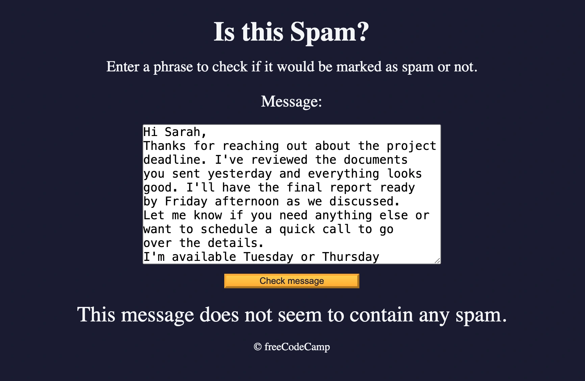

import Tabs from '@theme/Tabs';
import TabItem from '@theme/TabItem';

# Spam Filter




### The Project
Spam filter developed with Regular Expressions (Regex), real-time message validation and advanced pattern matching. An application that identifies spam messages through a deny list of specific regex patterns.

### Source Code

<Tabs>
<TabItem value="html" label="index.html" default>

```html
<!DOCTYPE html>
<html lang="en">
  <head>
    <meta charset="UTF-8" />
    <meta name="viewport" content="width=device-width" />
    <title>Learn Regular Expressions by Building a Spam Filter</title>
    <link rel="stylesheet" href="styles.css">
  </head>

  <body>
    <header class="main-text">
      <h1 class="title">Is this Spam?</h1>
      <p class="description">
        Enter a phrase to check if it would be marked as spam or not.
      </p>
    </header>

    <main>
      <label class="message-label" for="message-input">Message: </label>
      <textarea
        placeholder="Enter message here"
        value=""
        type="text"
        name="message"
        id="message-input"
        rows="10"
        cols="40"
      ></textarea>
      <button class="btn" id="check-message-btn" type="button">
        Check message
      </button>
      <p id="result"></p>
    </main>
    <footer class="footer">&copy; freeCodeCamp</footer>
    <script src="./script.js"></script>
  </body>
</html>
```
</TabItem>

<TabItem value="css" label="styles.css">

```css
*,
*::before,
*::after {
box-sizing: border-box;
margin: 0;
padding: 0;
}

:root {
--dark-grey: #1b1b32;
--light-grey: #f5f6f7;
--golden-yellow: #fecc4c;
--yellow: #ffcc4c;
--gold: #feac32;
--orange: #ffac33;
--dark-orange: #f89808;
}

body {
background-color: var(--dark-grey);
color: var(--light-grey);
}

body,
#message-input:placeholder-shown {
text-align: center;
}

textarea {
max-width: 90%;
}

.main-text {
margin: 25px 0;
}

.title {
font-size: 2.5rem;
}

.description {
margin-top: 15px;
font-size: 1.4rem;
}

.message-label {
display: block;
margin-bottom: 20px;
font-size: 1.5rem;
}

#message-input:placeholder-shown,
textarea {
font-size: 1.1rem;
}

.btn {
display: block;
cursor: pointer;
width: 200px;
margin: 10px auto;
color: var(--dark-grey);
background-color: var(--gold);
background-image: linear-gradient(var(--golden-yellow), var(--orange));
border-color: var(--gold);
border-width: 3px;
}

.btn:hover {
background-image: linear-gradient(var(--yellow), var(--dark-orange));
}

#result {
font-size: 2rem;
margin: 20px 0;
}

.footer {
margin-top: 10px;
}
```
</TabItem>

<TabItem value="js" label="script.js">

```js
const messageInput = document.getElementById("message-input");
const result = document.getElementById("result");
const checkMessageButton = document.getElementById("check-message-btn");

const helpRegex = /please help|assist me/i;
const dollarRegex = /[0-9]+\s*(?:hundred|thousand|million|billion)?\s+dollars/i;
const freeRegex = /(?:^|\s)fr[e3][e3] m[o0]n[e3]y(?:$|\s)/i;
const stockRegex = /(?:^|\s)[s5][t7][o0][c{[(]k [a@4]l[e3]r[t7](?:$|\s)/i;
const dearRegex = /(?:^|\s)d[e3][a@4]r fr[i1|][e3]nd(?:$|\s)/i;

const denyList = [helpRegex, dollarRegex, freeRegex, stockRegex, dearRegex];

const isSpam = (msg) => denyList.some((regex) => regex.test(msg));

checkMessageButton.addEventListener("click", () => {
if (messageInput.value === "") {
    alert("Please enter a message.");
    return;
}

result.textContent = isSpam(messageInput.value)
    ? "Oh no! This looks like a spam message."
    : "This message does not seem to contain any spam.";
messageInput.value = "";
});
```

</TabItem> 

<TabItem value="commented" label="explained">

```html
<!DOCTYPE html>
<!-- 🎯 HTML5 DECLARATION: "Welcome to the world of anti-spam filters!" -->
<!-- It's like building a digital detective that recognizes suspicious messages! 🕵️ -->

<html lang="en">
<!-- 🌍 MAIN CONTAINER: Our spam analysis laboratory -->
<!-- lang="en" = English, the language of regex and coding! 💻 -->

  <head>
    <!-- 🧠 THE COMMAND CENTER: Where we program our smart filter -->
    <!-- It's like the brain of our anti-spam detective! -->
    
    <meta charset="UTF-8" />
    <!-- 📝 UNIVERSAL CHARACTERS: UTF-8 to analyze texts in all languages! 🌐 -->
    
    <meta name="viewport" content="width=device-width" />
    <!-- 📱 RESPONSIVE DESIGN: Adapts to every screen -->
    <!-- width=device-width = device width, without initial-scale -->
    
    <title>Learn Regular Expressions by Building a Spam Filter</title>
    <!-- 📑 TITLE: Our educational project on regex! -->
    
    <style>
      /* 🎨 ===== UNIVERSAL RESET: Total Cleanup! ===== */
      
      *,
      *::before,
      *::after {
        box-sizing: border-box;
        /* 📦 BORDER-BOX: Includes padding and borders in dimensions */
        
        margin: 0;
        padding: 0;
        /* 🚫 ZERO SPACES: Complete reset for total control */
      }
      
      /* 🎨 ===== CSS VARIABLES: The Color Palette ===== */
      
      :root {
        /* 🌑 DARK THEME WITH GOLDEN ACCENTS */
        
        --dark-grey: #1b1b32;
        /* ⚫ DARK GREY: Main background, almost black */
        
        --light-grey: #f5f6f7;
        /* ⚪ LIGHT GREY: For texts, great contrast */
        
        --golden-yellow: #fecc4c;
        /* 🟡 GOLDEN YELLOW: Bright primary color */
        
        --yellow: #ffcc4c;
        /* 💛 PURE YELLOW: Slightly different for gradients */
        
        --gold: #feac32;
        /* 🥇 GOLD: Main button color */
        
        --orange: #ffac33;
        /* 🟠 ORANGE: For gradients and transitions */
        
        --dark-orange: #f89808;
        /* 🔶 DARK ORANGE: For hover effects */
      }
      
      /* 🎨 ===== BODY STYLES ===== */
      
      body {
        background-color: var(--dark-grey);
        /* 🌑 DARK BACKGROUND: Using the CSS variable */
        
        color: var(--light-grey);
        /* ⚪ LIGHT TEXT: High contrast for readability */
      }
      
      body,
      #message-input:placeholder-shown {
        text-align: center;
        /* ⚖️ CENTERING: Everything centered for elegance */
        /* :placeholder-shown = when placeholder is visible */
        /* Multiple selector with comma! */
      }
      
      /* 📝 ===== TEXTAREA ===== */
      
      textarea {
        max-width: 90%;
        /* 📏 MAXIMUM WIDTH: 90% to not touch edges */
        /* Natural responsive without media queries! */
      }
      
      /* 📄 ===== MAIN TEXTS ===== */
      
      .main-text {
        margin: 25px 0;
        /* 🌬️ VERTICAL MARGINS: Breathing room above and below */
      }
      
      .title {
        font-size: 2.5rem;
        /* 📏 BIG TITLE: 2.5rem = about 40px */
        /* rem = relative to root font-size */
      }
      
      .description {
        margin-top: 15px;
        /* ⬆️ SPACE ABOVE: Separates from title */
        
        font-size: 1.4rem;
        /* 📏 SUBTITLE: Smaller but readable */
      }
      
      /* 🏷️ ===== LABEL AND INPUT ===== */
      
      .message-label {
        display: block;
        /* 📦 BLOCK: Goes to new line from input */
        
        margin-bottom: 20px;
        /* ⬇️ SPACE BELOW: Before textarea */
        
        font-size: 1.5rem;
        /* 📏 SIZE: Well visible */
      }
      
      #message-input:placeholder-shown,
      textarea {
        font-size: 1.1rem;
        /* 📝 INPUT TEXT: Slightly larger than normal */
        /* Two selectors to be sure! */
      }
      
      /* 🔘 ===== BUTTON ===== */
      
      .btn {
        display: block;
        /* 📦 BLOCK: On its own line */
        
        cursor: pointer;
        /* 👆 POINTER: Indicates it's clickable */
        
        width: 200px;
        /* 📏 FIXED WIDTH: Always 200px */
        
        margin: 10px auto;
        /* ⚖️ CENTERING: auto on sides = centered */
        
        color: var(--dark-grey);
        /* ⚫ DARK TEXT: On light background */
        
        background-color: var(--gold);
        /* 🥇 GOLD BACKGROUND: Base color */
        
        background-image: linear-gradient(var(--golden-yellow), var(--orange));
        /* 🌅 GRADIENT: From golden yellow to orange */
        /* Subtle 3D effect! */
        
        border-color: var(--gold);
        /* 🔲 BORDER: Same color as background */
        
        border-width: 3px;
        /* 📏 BORDER THICKNESS: Well visible */
      }
      
      .btn:hover {
        background-image: linear-gradient(var(--yellow), var(--dark-orange));
        /* 🔥 HOVER: More intense gradient! */
        /* From yellow to dark orange */
        /* Immediate visual feedback */
      }
      
      /* 📊 ===== RESULT ===== */
      
      #result {
        font-size: 2rem;
        /* 📏 LARGE TEXT: For spam/no spam verdict */
        
        margin: 20px 0;
        /* 🌬️ SPACE: Above and below */
      }
      
      /* 🦶 ===== FOOTER ===== */
      
      .footer {
        margin-top: 10px;
        /* ⬆️ SMALL SPACE: Separates from content */
      }
    </style>
  </head>

  <body>
    <!-- 🕵️ ===== THE ANTI-SPAM FILTER COMES TO LIFE! ===== -->
    
    <header class="main-text">
      <!-- 📰 HEADER: Title and instructions -->
      
      <h1 class="title">Is this Spam?</h1>
      <!-- 🔍 MAIN QUESTION: Direct and clear -->
      
      <p class="description">
        Enter a phrase to check if it would be marked as spam or not.
      </p>
      <!-- 📝 INSTRUCTIONS: Explains what to do -->
    </header>

    <main>
      <!-- 📄 MAIN CONTENT: The filter interface -->
      
      <label class="message-label" for="message-input">Message: </label>
      <!-- 🏷️ LABEL: Connected to input via for="id" -->
      
      <textarea
        placeholder="Enter message here"
        value=""
        type="text"
        name="message"
        id="message-input"
        rows="10"
        cols="40"
      ></textarea>
      <!-- 📝 TEXT AREA: For long messages -->
      <!-- placeholder = hint text -->
      <!-- rows="10" = 10 rows height -->
      <!-- cols="40" = 40 columns width -->
      <!-- type="text" not needed for textarea but doesn't hurt -->
      
      <button class="btn" id="check-message-btn" type="button">
        Check message
      </button>
      <!-- 🔘 BUTTON: type="button" prevents accidental submits -->
      
      <p id="result"></p>
      <!-- 📊 RESULT: Initially empty, filled by JS -->
    </main>

    <footer class="footer">&copy; freeCodeCamp</footer>
    <!-- 🦶 FOOTER: Copyright with HTML entity &copy; -->
    
    <script>
      /* 🧠 ===== JAVASCRIPT: The Brain of the Anti-Spam Filter! ===== */
      
      const messageInput = document.getElementById("message-input");
      /* 📝 TEXTAREA REFERENCE: We capture the element where user types */
      /* document.getElementById() = finds element by ID */
      /* const = constant, won't change */
      
      const result = document.getElementById("result");
      /* 📊 RESULT REFERENCE: Where we'll show spam/no spam */
      
      const checkMessageButton = document.getElementById("check-message-btn");
      /* 🔘 BUTTON REFERENCE: To attach the event listener */
      
      /* 🔍 ===== THE REGEX: Patterns to Search For ===== */
      /* RegEx = Regular Expression */
      /* They're patterns to search text intelligently! */
      
      const helpRegex = /please help|assist me/i;
      /* 🆘 HELP REQUESTS: Spam often fakes emergencies */
      /* /pattern/i = i flag means case-insensitive */
      /* | = logical OR, finds "please help" OR "assist me" */
      /* Typical spam: "Please help me transfer money!" */
      
      const dollarRegex = /[0-9]+\s*(?:hundred|thousand|million|billion)?\s+dollars/i;
      /* 💰 MONEY MENTIONS: Complex pattern! */
      /* [0-9]+ = one or more numbers */
      /* \s* = zero or more spaces */
      /* (?:...) = non-capturing group */
      /* hundred|thousand|million|billion = number scales */
      /* ? = optional (may or may not be there) */
      /* \s+ = one or more spaces */
      /* Finds: "5 million dollars", "100 dollars", "50thousand dollars" */
      
      const freeRegex = /(?:^|\s)fr[e3][e3] m[o0]n[e3]y(?:$|\s)/i;
      /* 🎁 FREE MONEY: With leet speak variants! */
      /* (?:^|\s) = start of string OR space (word boundary) */
      /* [e3] = 'e' OR '3' (leet speak) */
      /* [o0] = 'o' OR '0' (zero) */
      /* (?:$|\s) = end of string OR space */
      /* Finds: "free money", "fr33 m0n3y", "FREE MON3Y" */
      
      const stockRegex = /(?:^|\s)[s5][t7][o0][c{[(]k [a@4]l[e3]r[t7](?:$|\s)/i;
      /* 📈 STOCK ALERT: Super leet speak! */
      /* [s5] = 's' OR '5' */
      /* [t7] = 't' OR '7' */
      /* [c{[(] = 'c', '{', '[' or '(' */
      /* [a@4] = 'a', '@' or '4' */
      /* Finds: "stock alert", "5t0ck @l3rt", "S7O{K AL3R7" */
      
      const dearRegex = /(?:^|\s)d[e3][a@4]r fr[i1|][e3]nd(?:$|\s)/i;
      /* 👋 DEAR FRIEND: Classic spam beginning */
      /* [i1|] = 'i', '1' or '|' (pipe) */
      /* Finds: "dear friend", "d3@r fr|3nd", "DEAR FR1END" */
      
      /* 🚫 ===== BLACK LIST: All Spam Patterns ===== */
      
      const denyList = [helpRegex, dollarRegex, freeRegex, stockRegex, dearRegex];
      /* 📋 REGEX ARRAY: All patterns in an array */
      /* Easier to manage and extend */
      
      /* 🔍 ===== SPAM CHECK FUNCTION ===== */
      
      const isSpam = (msg) => denyList.some((regex) => regex.test(msg));
      /* 🧮 ARROW FUNCTION: Modern and concise syntax */
      /* (msg) => ... is like function(msg) { return ... } */
      /* .some() = returns true if AT LEAST ONE element satisfies the condition */
      /* regex.test(msg) = tests if pattern matches the message */
      /* In practice: "It's spam if ANY pattern is found" */
      
      /* 🎯 ===== EVENT LISTENER: The Heart of the App ===== */
      
      checkMessageButton.addEventListener("click", () => {
        /* 🖱️ LISTEN FOR CLICK: When user presses the button */
        /* Anonymous arrow function as callback */
        
        if (messageInput.value === "") {
          /* ❌ VALIDATION: Check if field is empty */
          /* .value = the text inside textarea */
          /* === strict comparison (type and value) */
          
          alert("Please enter a message.");
          /* 🚨 ALERT: Warning popup */
          /* Old school method but effective */
          
          return;
          /* 🛑 STOP: Exits function, doesn't continue */
        }
      
        result.textContent = isSpam(messageInput.value)
          ? "Oh no! This looks like a spam message."
          : "This message does not seem to contain any spam.";
        /* 🎯 TERNARY OPERATOR: if/else in one line! */
        /* condition ? if_true : if_false */
        /* textContent = changes paragraph text */
        /* If isSpam() returns true → spam message */
        /* If isSpam() returns false → clean message */
        
        messageInput.value = "";
        /* 🧹 CLEANUP: Empties textarea after check */
        /* UX touch: ready for next test */
      });
    </script>
  </body>
</html>

<!-- 🎯 ===== SPAM FILTER SUMMARY ===== -->
<!-- 
🕵️ SPAM FILTER ARCHITECTURE:
│
├── 🧠 HEAD (setup and styles)
│   └── 🎨 CSS with:
│       ├── 🎨 7 color variables (dark theme + gold)
│       ├── 🌅 Gradients for 3D effects on buttons
│       ├── 📱 Responsive design with max-width
│       └── 🎯 Elegant centering
│
├── 📄 BODY (interface)
│   ├── 📰 Header (title + description)
│   ├── 📝 Main
│   │   ├── 🏷️ Label
│   │   ├── 📝 Textarea (10x40)
│   │   ├── 🔘 Button (with gradient)
│   │   └── 📊 Result (initially empty)
│   └── 🦶 Footer (copyright)
│
└── 🧠 JAVASCRIPT (the logic)
    ├── 🔗 3 DOM references
    ├── 🔍 5 RegEx patterns
    │   ├── Help requests
    │   ├── Dollar amounts
    │   ├── Free money (leet)
    │   ├── Stock alerts (leet)
    │   └── Dear friend (leet)
    ├── 🚫 denyList array
    ├── 🧮 isSpam() with .some()
    └── 🖱️ Event listener with validation

🎯 KEY JAVASCRIPT CONCEPTS:
├── 📦 const vs let
├── 🔍 Regular Expressions with flags
├── 📋 Array methods (.some())
├── ➡️ Arrow functions
├── 🎯 Ternary operator
├── 🖱️ Event listeners
└── 🧹 DOM manipulation

💡 REGEX FEATURES:
├── | = OR operator
├── [abc] = character class
├── + = one or more
├── * = zero or more
├── ? = optional
├── \s = space
├── (?:) = non-capturing group
├── ^ and $ = start/end of string
└── /i = case insensitive

It's like having a digital detective that knows how to recognize spammers' tricks! 🕵️✨
-->
```
</TabItem>

</Tabs>

### Two Weeks of Strategic Break

<div className="alert alert--info" style={{marginBottom: '1rem', paddingBottom: 1}}>

Almost two weeks have passed since the last project because I decided to pause the freeCodeCamp curriculum to complete **Course 5 of the Google UX Certificate**.<br />
This wasn't just a study break. I used this time to prototype a real-world **Maintenance App** for the factory where I worked. It turned into a massive lesson on **User Research failures** and adapting UI to industrial environments (switching from Material to Metro Design).<br />
I have documented this entire detour, including the analysis of my recruiting mistakes, in a dedicated Case Study.

**[Read the Maintenance Case Study](/docs/Featured/maintenance-ui-concept)**
</div>

### The Spam Filter Project

That said, this Spam Filter was a short project but to which I devoted more time than I thought for a specific reason: I summarized all the new concepts, I went beyond the cases that freeCodeCamp explained to me and now I have valuable material ready to be integrated into the vademecum.

### What I Learned

**Regular Expressions (Regex) Fundamentals:**
- Pattern matching with `/pattern/flags`
- Flag `i` for case-insensitive matching
- Character classes and alternation `[e3]` for variants
- Non-capturing groups `(?:pattern)` for organization
- Boundary matching `(?:^|\s)` for word boundaries

**Advanced Regex Patterns:**
- Quantifiers `+`, `*`, `?` for variable occurrences
- Lookahead and lookbehind assertions
- Escape sequences for special characters
- Alternative character matching `[o0]`, `[e3]`, `[a@4]`

**Array Methods with Regex:**
- `.test()` to verify pattern match
- `.some()` to test array of regex
- Functional programming for validation logic

**Spam Detection Patterns:**
- Deny list approach for known patterns
- Multiple regex combinations
- Leet speak detection (`fr[e3][e3]`, `m[o0]n[e3]y`)
- Context-aware pattern matching

**UX Research Methodologies:**
- Blue sky research for design innovation
- Moderated vs unmoderated usability testing
- Test script design and task formulation
- Bias awareness and mitigation

**Lessons from Usability Testing:**
- Message format: voice > long text
- Clear incentives from the start
- Instruction simplification
- Task ordering importance
- "Don't Make Me Think" principle in action

**Design System Evolution:**
- From Material Design to Metro Design
- Platform-specific design choices
- Comfort zone consideration for users

**Professional Growth:**
- Ownership of errors
- Iterative testing approach
- User-centered thinking
- Complete documentation for vademecum

---

**Next Project**: Learn Basic Algorithmic Thinking by Building a Number Sorter
